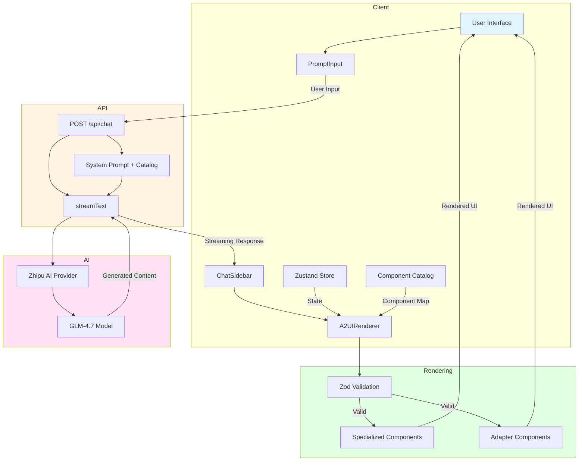
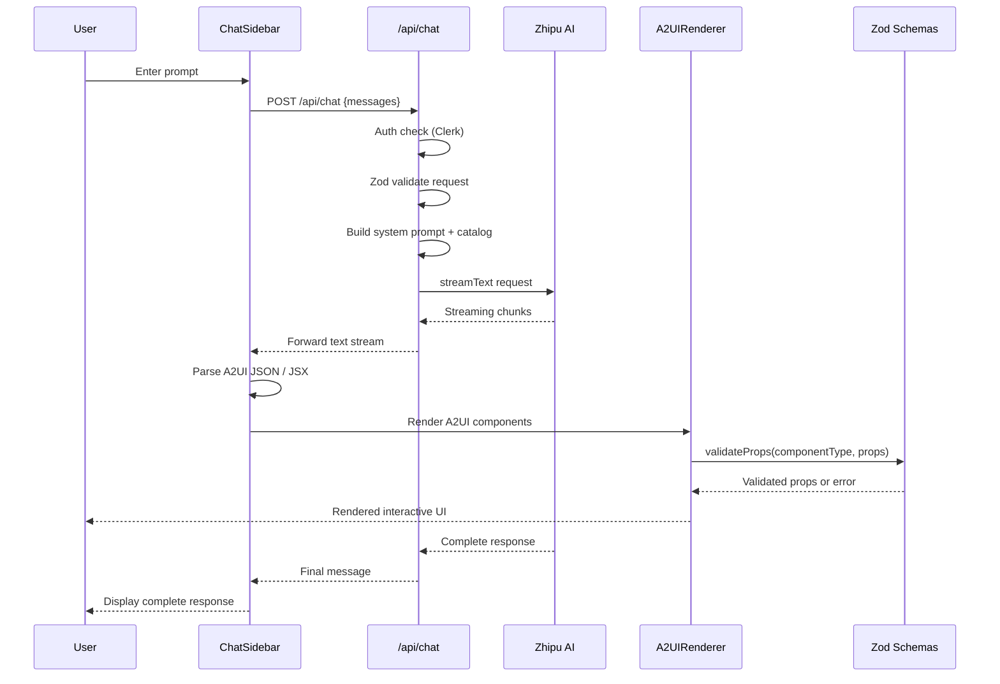
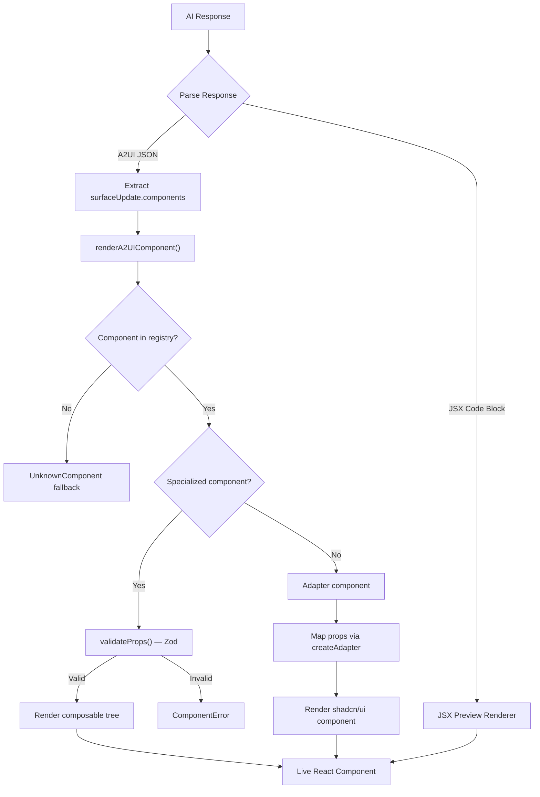
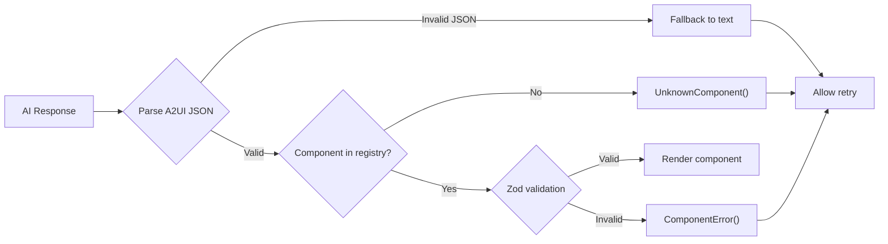

# Architecture

This document describes the architecture of Generous Works — a streaming generative UI platform where AI generates live, interactive React components in real time.

> **Source files referenced throughout:**
> - [`app/api/chat/route.ts`](../app/api/chat/route.ts) — Primary chat API endpoint
> - [`lib/a2ui/renderer.tsx`](../lib/a2ui/renderer.tsx) — A2UI component renderer
> - [`lib/a2ui/catalog.ts`](../lib/a2ui/catalog.ts) — Specialized component catalog
> - [`lib/a2ui/catalog-standard-ui.ts`](../lib/a2ui/catalog-standard-ui.ts) — Standard UI component catalog
> - [`lib/a2ui/types.ts`](../lib/a2ui/types.ts) — A2UI type definitions
> - [`lib/store.ts`](../lib/store.ts) — Zustand global store
> - [`lib/schemas/index.ts`](../lib/schemas/index.ts) — Zod validation schemas

---

## Table of Contents

- [Overview](#overview)
- [Architecture Diagram](#architecture-diagram)
- [Data Flow](#data-flow)
- [Rendering Pipeline](#rendering-pipeline)
- [State Management](#state-management)
- [Component Integration](#component-integration)
- [Error Handling](#error-handling)

---

## Overview

The Generous Works architecture defines a comprehensive generative UI system built on Next.js. The system enables AI to generate, modify, and render React components dynamically through natural language conversation.

### Key Technologies

| Layer | Technology |
|---|---|
| **Framework** | Next.js 16 (App Router, Turbopack) |
| **UI** | React 19, Tailwind CSS 4, shadcn/ui + Radix UI |
| **AI** | Vercel AI SDK 6, A2UI specification |
| **State** | Zustand v5 with persistence middleware |
| **Validation** | Zod (runtime type safety for all component props) |
| **Auth** | Clerk v6 |
| **AI Provider** | Zhipu AI (GLM-4.7 default; OpenAI, Anthropic, Google supported) |

### Core Capabilities

1. **Streaming Responses** — Real-time text and UI component generation via [`streamText()`](../app/api/chat/route.ts:792)
2. **Dual Rendering Pipeline** — JSX for simple UI elements and A2UI JSON for complex data-driven components, mixed in a single response
3. **114+ Component Registry** — Mapped AI component names to actual React components across three categories (AI Elements, Tool UI, Standard UI)
4. **Runtime Type Safety** — Zod schemas validate all component props before rendering via [`validateProps()`](../lib/schemas/index.ts)
5. **Conversation History** — Persistent context across interactions via Zustand with localStorage persistence
6. **Error Recovery** — Graceful handling of invalid/incomplete JSX and A2UI specs with fallback UI

---

## Architecture Diagram



---

## Data Flow

### End-to-End Request Flow



### Message Processing Pipeline

The chat API processes messages through a well-defined pipeline:

1. **Authentication** — Clerk [`auth()`](../app/api/chat/route.ts:751) verifies the user identity
2. **Request Validation** — [`chatRequestSchema`](../app/api/chat/route.ts:741) validates the request body with Zod
3. **System Prompt Assembly** — [`getSystemPrompt()`](../app/api/chat/route.ts) injects the component catalog via [`getCatalogPrompt()`](../lib/a2ui/catalog.ts)
4. **AI Streaming** — [`streamText()`](../app/api/chat/route.ts:792) streams the AI response token by token
5. **Response Parsing** — The client extracts A2UI JSON (`surfaceUpdate` objects) and JSX code blocks from the streamed text
6. **Component Rendering** — The [`A2UIRenderer`](../lib/a2ui/renderer.tsx) renders validated components

### A2UI Data Format

The AI generates components using the [A2UI specification](https://a2ui.org/). The core types are defined in [`lib/a2ui/types.ts`](../lib/a2ui/types.ts):

```typescript
// A2UI message envelope
interface A2UIMessage {
  surfaceUpdate?: SurfaceUpdate;   // UI components to render
  dataModelUpdate?: DataModelUpdate; // Application state changes
  beginRendering?: boolean;         // Signal to start rendering
}

// Component specification
interface A2UIComponent {
  id: string;                       // Unique instance identifier
  component: {
    [componentType: string]: Record<string, unknown>; // Type-keyed props
  };
  parentId?: string;                // For nesting
  children?: string[];              // Child component IDs
}
```

Example AI-generated A2UI JSON:

```json
{
  "surfaceUpdate": {
    "components": [
      {
        "id": "charts-1",
        "component": {
          "Charts": {
            "data": { "series": [{"name": "Revenue", "data": [10, 20, 30]}] },
            "options": { "title": "Quarterly Revenue" }
          }
        }
      }
    ]
  }
}
```

---

## Rendering Pipeline

The rendering pipeline is the heart of the system, converting AI-generated specifications into live React components. It is implemented in [`lib/a2ui/renderer.tsx`](../lib/a2ui/renderer.tsx).

### Component Categories

The system supports **114+ components** across three categories, each with a distinct rendering path:

| Category | Count | Rendering Path | Examples |
|---|---|---|---|
| **AI Elements** | 38 | Specialized (Zod + composable) | Charts, Maps, ThreeScene, Timeline, NodeEditor, CodeEditor |
| **Tool UI** | 16 | Specialized (Zod + composable) | WeatherWidget, XPost, ParameterSlider, ApprovalCard |
| **Standard UI Adapters** | 76 | Adapter (prop mapping) | Button, Card, Input, Dialog, Tabs, Alert |

### Rendering Flow



### Specialized Component Rendering

Specialized components (AI Elements and Tool UI) follow the **composable pattern** — each component has a tree of sub-components (Header, Content, Actions, etc.) that provide consistent structure:

```typescript
// From lib/a2ui/renderer.tsx — specialized component rendering
case 'Charts': {
  const chartsProps = validation.data as ChartsProps;
  return (
    <div data-a2ui-id={componentId} data-a2ui-type={componentType}>
      <Charts {...chartsProps}>
        <ChartsHeader>
          <ChartsTitle>Chart</ChartsTitle>
          <ChartsActions>
            <ChartsCopyButton />
            <ChartsFullscreenButton />
          </ChartsActions>
        </ChartsHeader>
        <ChartsContent />
      </Charts>
    </div>
  );
}
```

The [`SPECIALIZED_COMPONENTS`](../lib/a2ui/renderer.tsx:254) set defines which component types use this path. Each goes through:

1. **Zod validation** via [`validateProps(componentType, props)`](../lib/schemas/index.ts)
2. **Composable rendering** with a standard sub-component tree (Header → Title + Actions, Content)
3. **Built-in features** — copy, fullscreen, and reset buttons come free from the composable pattern

### Adapter Component Rendering

Standard UI components use the **adapter pattern** — lightweight wrappers that map A2UI props to shadcn/ui component props:

```typescript
// From lib/a2ui/adapters/ — adapter pattern
import { createAdapter, extractValue } from '@/lib/a2ui/adapter';
import { Button } from '@/components/ui/button';

export const ButtonAdapter = createAdapter(Button, {
  mapProps: (a2ui, ctx) => ({
    variant: extractValue(a2ui.variant),
    size: extractValue(a2ui.size),
    disabled: extractValue(a2ui.disabled) ?? false,
    children: ctx.children,
  }),
  displayName: 'A2UI(Button)',
});
```

Adapters are registered in [`lib/a2ui/components.ts`](../lib/a2ui/components.ts) and looked up by the renderer at [`a2uiComponents[componentType]`](../lib/a2ui/renderer.tsx:354).

### JSX Rendering

For simple UI elements, the AI can generate JSX wrapped in ` ```tsx ` code blocks. These are parsed and rendered client-side using `react-jsx-parser` with the component registry providing bindings. The existing streaming support handles incomplete JSX during rendering by:

1. Tracking open tag stack
2. Auto-closing unclosed tags
3. Preserving partial content for progressive display

---

## State Management

State management uses **Zustand v5** with persistence middleware, implemented in [`lib/store.ts`](../lib/store.ts).

### Store Architecture

```typescript
// Core state shape (lib/store.ts)
interface StoreState {
  messages: Message[];                              // Conversation history
  uiComponents: Record<string, UIComponent>;        // Dynamic component registry
  isLoading: boolean;                               // Loading indicator
  error: string | null;                             // Error state
}

interface StoreActions {
  // Message actions
  addMessage: (message: Message) => void;
  updateMessage: (id: string, updates: Partial<Message>) => void;
  setMessages: (messages: Message[]) => void;
  clearMessages: () => void;

  // UI Component actions
  addUIComponent: (component: UIComponent) => void;
  updateUIComponent: (id: string, updates: Partial<UIComponent>) => void;
  removeUIComponent: (id: string) => void;
  clearUIComponents: () => void;

  // State actions
  setLoading: (isLoading: boolean) => void;
  setError: (error: string | null) => void;
  reset: () => void;
}
```

### Key Types

```typescript
// Message type (lib/store.ts)
interface Message {
  id: string;
  role: 'user' | 'assistant' | 'system';
  content: string;
  jsx?: string;                    // Optional JSX content
  timestamp?: number;
  uiComponents?: UIComponent[];    // Associated UI components
}

// Dynamic UI component (lib/store.ts)
interface UIComponent {
  id: string;
  type: string;                    // Component type name (e.g., 'Charts', 'Button')
  props: Record<string, unknown>;  // Component props
  children?: UIComponent[];        // Nested children
  parentId?: string;               // Parent reference
  state?: Record<string, unknown>; // Interactive state
}
```

### Persistence

The store uses Zustand's `persist` middleware to save conversation history and UI component state to `localStorage`. This ensures that:

- Conversations survive page refreshes
- UI component state is preserved across sessions
- The store can be hydrated on initial load

### Usage Pattern

Components access the store via the [`useGenerativeUIStore`](../lib/store.ts:109) hook:

```typescript
import { useGenerativeUIStore } from '@/lib/store';

function ChatComponent() {
  const { messages, addMessage, isLoading } = useGenerativeUIStore();
  // ...
}
```

---

## Component Integration

### Component Catalog System

The catalog is the AI's vocabulary — it defines every component the AI model is allowed to generate. It is split into two files:

- [`lib/a2ui/catalog.ts`](../lib/a2ui/catalog.ts) — AI Elements and Tool UI (specialized components)
- [`lib/a2ui/catalog-standard-ui.ts`](../lib/a2ui/catalog-standard-ui.ts) — Standard UI adapters

Each catalog entry follows this structure:

```typescript
// From lib/a2ui/catalog.ts
Charts: {
  type: 'Charts',
  description: 'Interactive data visualizations using amCharts 5. Supports line, bar, pie, scatter...',
  props: ['data', 'options'],
  examples: [chartsExamples]  // ComponentExample objects with real A2UI specs
}
```

The four parts of each entry:

| Field | Purpose |
|---|---|
| **`type`** | Must exactly match the key in the renderer's [`SPECIALIZED_COMPONENTS`](../lib/a2ui/renderer.tsx:254) set and [`a2uiComponents`](../lib/a2ui/components.ts) map |
| **`description`** | Plain English explanation injected verbatim into the AI system prompt |
| **`props`** | Top-level prop names the component accepts (used in prompt) |
| **`examples`** | One or more `ComponentExample` objects with real A2UI JSON specs |

### System Prompt Injection

[`getCatalogPrompt()`](../lib/a2ui/catalog.ts) iterates over every entry in both catalogs and assembles a formatted string. This is injected into the system prompt by [`getSystemPrompt()`](../app/api/chat/route.ts) on every request:

```text
You can generate interactive UIs using 114 components across two categories:

## SPECIALIZED COMPONENTS (Data Visualization & Interactive)

1. Charts
   Description: Interactive data visualizations using amCharts 5...
   Props: data, options
   Example A2UI spec: { "id": "charts-1", "component": { "Charts": { ... } } }
...
```

> **Important:** A component that exists in the renderer but has no catalog entry is invisible to the AI model. Conversely, a catalog entry with no renderer registration will generate JSON that the renderer cannot render. Both sides must be kept in sync.

### Adding a New Component

To add a new component, three things must be kept in sync:

1. **React component** — Place in `components/ai-elements/` (AI Elements) or `components/tool-ui/` (Tool UI)
2. **Zod schema** — Add to [`lib/schemas/`](../lib/schemas/index.ts) for runtime validation
3. **Catalog entry** — Add to [`lib/a2ui/catalog.ts`](../lib/a2ui/catalog.ts) or [`lib/a2ui/catalog-standard-ui.ts`](../lib/a2ui/catalog-standard-ui.ts)
4. **Renderer registration** — Add to [`SPECIALIZED_COMPONENTS`](../lib/a2ui/renderer.tsx:254) set and render switch (for specialized) or [`a2uiComponents`](../lib/a2ui/components.ts) map (for adapters)

See [`lib/a2ui/README.md`](../lib/a2ui/README.md) for the complete step-by-step guide.

---

## Error Handling

### Error Types

The system handles errors at multiple levels:

| Error Type | Where | Recovery |
|---|---|---|
| **Invalid A2UI JSON** | Client-side parser | Fallback to text display |
| **Zod validation failure** | [`renderA2UIComponent()`](../lib/a2ui/renderer.tsx:329) | Show [`ComponentError`](../lib/a2ui/renderer.tsx:283) with error details |
| **Unknown component type** | [`renderA2UIComponent()`](../lib/a2ui/renderer.tsx:329) | Show [`UnknownComponent`](../lib/a2ui/renderer.tsx:312) fallback |
| **API authentication** | [`POST /api/chat`](../app/api/chat/route.ts:749) | 401 response |
| **Request validation** | [`chatRequestSchema`](../app/api/chat/route.ts:741) | 400 response with Zod error details |
| **AI provider error** | [`streamText()`](../app/api/chat/route.ts:792) | Error logged, appropriate HTTP status returned |
| **Incomplete JSX** | JSX renderer | Auto-close unclosed tags via streaming JSX parser |

### Error Flow



### API Error Responses

The [`POST /api/chat`](../app/api/chat/route.ts:749) endpoint returns structured error responses:

| Status | Condition | Response |
|---|---|---|
| `401` | Missing Clerk authentication | `{ error: "Unauthorized" }` |
| `400` | Invalid request body | `{ error: "Invalid request body", details: ... }` |
| `400` | Missing messages and prompt | `{ error: "Either 'messages' or 'prompt' is required" }` |
| `401` | AI provider API key error | `{ error: "Authentication failed..." }` |
| `429` | Rate limit exceeded | `{ error: "Rate limit exceeded..." }` |
| `503` | Network error | `{ error: "Network error..." }` |
| `500` | Unexpected error | `{ error: "An unexpected error occurred..." }` |

---

## File Structure

```text
Generous-Works/
├── app/
│   ├── api/
│   │   ├── chat/route.ts              # Primary streaming chat API
│   │   ├── a2ui-chat/route.ts         # A2UI-specific chat endpoint
│   │   └── maf/chat/route.ts          # MAF chat endpoint
│   ├── canvas/page.tsx                # Canvas-based UI surface
│   └── page.tsx                       # Main chat interface
├── components/
│   ├── ai-elements/                   # 38 AI Element components
│   │   ├── charts.tsx                 # amCharts visualizations
│   │   ├── maps.tsx                   # MapLibre maps
│   │   ├── threescene.tsx             # Three.js 3D scenes
│   │   ├── timeline.tsx               # Timeline visualizations
│   │   ├── codeeditor.tsx             # CodeMirror editor
│   │   ├── node-editor.tsx            # XYFlow node editor
│   │   ├── mermaid.tsx                # Mermaid diagrams
│   │   ├── latex.tsx                  # KaTeX rendering
│   │   └── ...                        # 30+ more AI elements
│   ├── tool-ui/                       # 16 Tool UI components
│   │   ├── weather-widget/
│   │   ├── x-post/
│   │   ├── parameter-slider/
│   │   └── ...
│   └── ui/                            # 76 shadcn/ui primitives
│       ├── button.tsx
│       ├── card.tsx
│       ├── dialog.tsx
│       └── ...
├── lib/
│   ├── a2ui/
│   │   ├── renderer.tsx               # A2UI rendering engine
│   │   ├── catalog.ts                 # Specialized component catalog
│   │   ├── catalog-standard-ui.ts     # Standard UI catalog
│   │   ├── catalog-variants.ts        # Variant definitions
│   │   ├── components.ts              # Component registry map
│   │   ├── types.ts                   # A2UI type definitions
│   │   ├── adapter.ts                 # Adapter utilities
│   │   └── adapters/                  # 76 Standard UI adapters
│   │       ├── button.tsx
│   │       ├── card.tsx
│   │       ├── input.tsx
│   │       └── ...
│   ├── schemas/                       # Zod validation schemas
│   │   ├── index.ts                   # validateProps() dispatcher
│   │   ├── charts.schema.ts
│   │   ├── maps.schema.ts
│   │   ├── threescene.schema.ts
│   │   └── ...
│   ├── store.ts                       # Zustand global store
│   └── utils.ts                       # Utility functions
├── docs/
│   ├── ARCHITECTURE.md                # This document
│   └── API.md                         # API reference
└── middleware.ts                      # Clerk authentication middleware
```

---

## Design Principles

1. **Streaming Priority** — The system prioritizes streaming responses for real-time feedback. The [`streamText()`](../app/api/chat/route.ts:792) API streams tokens as they arrive.

2. **Runtime Type Safety** — All dynamically rendered components are validated against Zod schemas before rendering. This prevents malformed AI output from crashing the UI.

3. **Component Safety** — Only components registered in the catalog and renderer can be displayed. Unknown types render a fallback [`UnknownComponent`](../lib/a2ui/renderer.tsx:312) instead of crashing.

4. **Dual Pipeline** — JSX for simple, visual elements and A2UI JSON for complex, data-driven components. Both can be mixed in a single AI response.

5. **Extensibility** — The catalog + registry pattern allows adding new components without modifying core rendering logic. Add the component, schema, catalog entry, and renderer case independently.

6. **Multi-Provider Support** — The architecture supports switching between AI providers (Zhipu, OpenAI, Anthropic, Google) through environment configuration. See [`.env.example`](../.env.example) for all supported providers.
