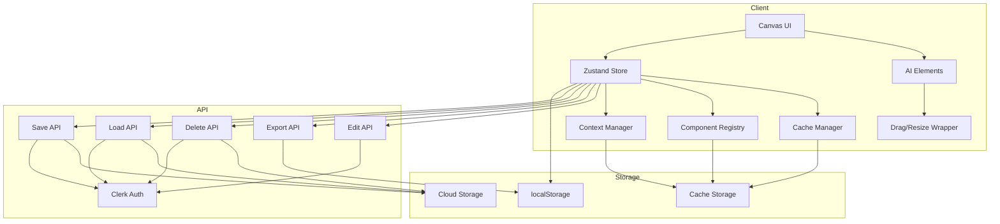
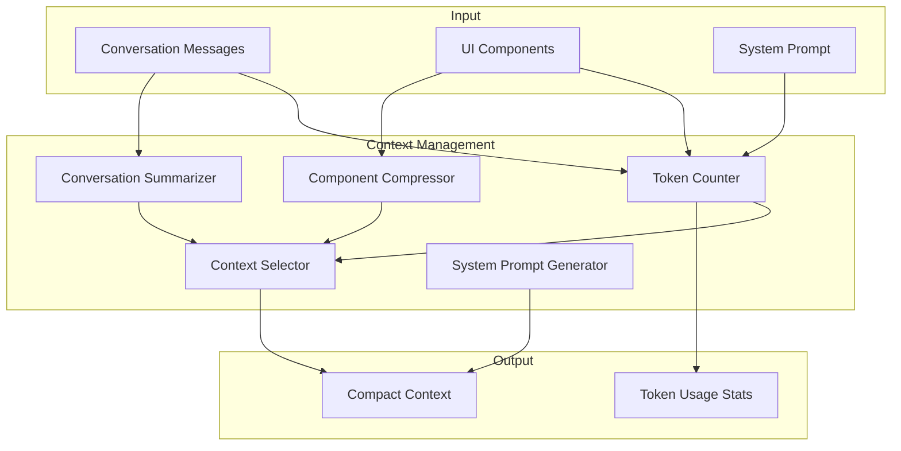
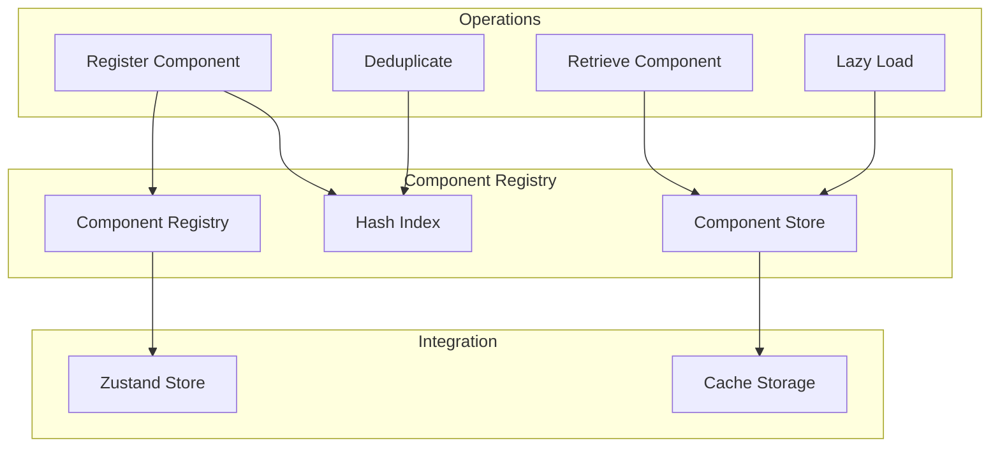
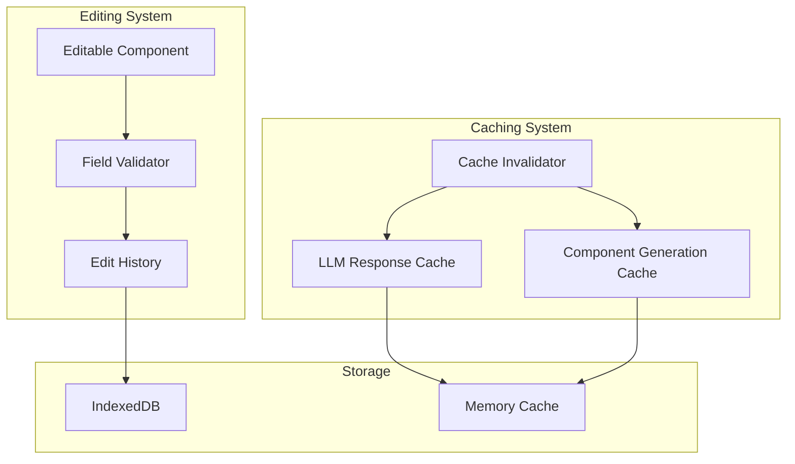

# Generations Management Implementation Plan

**Document Version:** 2.0  
**Date:** 2025-02-13  
**Status:** Draft  

---

## Executive Summary

This document outlines a comprehensive implementation plan for adding generations management capabilities to the Generous platform. The plan covers three major feature areas:

1. **Clear Generations Feature** - UI and UX for clearing messages and UI components
2. **Draggable/Resizable Components** - Interactive component positioning and sizing
3. **Save/Download/Delete Functionality** - Persistent storage and export capabilities

Additionally, this plan includes advanced optimization features:

4. **Context Window Management** - Hybrid approach for efficient LLM context handling
5. **Component Compaction Strategy** - Registry-based component optimization
6. **Editing and Caching Strategy** - Editable components with intelligent caching
7. **Advanced Features** - Versioning, templates, sharing, and analytics

The implementation leverages existing infrastructure including Zustand state management, ReactFlow for canvas interactions, Clerk authentication, and a comprehensive component catalog of 114+ AI elements.

---

## Table of Contents

1. [Executive Summary](#executive-summary)
2. [Feature Requirements](#feature-requirements)
3. [Technical Architecture](#technical-architecture)
4. [Component Design](#component-design)
5. [Generations Dashboard Component](#generations-dashboard-component)
6. [API Design](#api-design)
7. [Storage Solution Recommendation](#storage-solution-recommendation)
8. [Implementation Phases](#implementation-phases)
9. [Advanced Features & Optimization](#advanced-features--optimization)
10. [Risk Assessment](#risk-assessment)
11. [Testing Strategy](#testing-strategy)
12. [Appendices](#appendices)

---

## Feature Requirements

### 1. Clear Generations Feature

#### User Stories
- As a user, I want to clear all messages and UI components with a single action to start fresh
- As a user, I want to clear only the messages while preserving my UI components
- As a user, I want to clear only the UI components while preserving my conversation
- As a user, I want confirmation dialogs before destructive actions to prevent accidental data loss
- As a user, I want keyboard shortcuts for quick access to clear functions

#### Functional Requirements
- **Clear All**: Single button to clear both messages and UI components
- **Clear Messages Only**: Option to clear conversation history only
- **Clear UI Components Only**: Option to clear generated UI components only
- **Confirmation Dialog**: Modal dialog requiring user confirmation before clearing
- **Keyboard Shortcuts**: Accessible shortcuts (e.g., `Ctrl/Cmd + Shift + C` for clear all)
- **Undo Capability**: Optional undo functionality for clear actions (future enhancement)

#### Non-Functional Requirements
- Clear actions must complete within 100ms for optimal UX
- Confirmation dialogs must be accessible (ARIA compliant)
- Keyboard shortcuts must be documented and discoverable
- Clear operations must persist to localStorage immediately

---

### 2. Draggable/Resizable Components

#### User Stories
- As a user, I want to drag components around the canvas to organize my workspace
- As a user, I want to resize components to better fit their content
- As a user, I want components to maintain their state during drag/resize operations
- As a user, I want the layout to be responsive and adapt to different screen sizes
- As a user, I want to lock components in place to prevent accidental movement

#### Functional Requirements
- **Draggable Components**: Ability to move components by clicking and dragging
- **Resizable Components**: Ability to resize components using handles
- **State Preservation**: Component state must persist during drag/resize
- **Layout Persistence**: Component positions and sizes must be saved
- **Lock/Unlock**: Toggle to prevent accidental movement
- **Snap to Grid**: Optional grid alignment for organized layouts
- **Responsive Behavior**: Adaptive sizing for mobile/tablet views

#### Priority Components (Phase 1)
1. Charts
2. Timeline
3. Maps
4. ThreeScene
5. KnowledgeGraph
6. DataTable
7. CodeEditor
8. Markdown

#### Non-Functional Requirements
- Drag/resize must maintain 60fps performance
- Minimum drag threshold to prevent accidental movement (5px)
- Component state updates must be debounced (300ms)
- Touch support for mobile devices

---

### 3. Save/Download/Delete Functionality

#### User Stories
- As a user, I want to save my generations to the cloud for access across devices
- As a user, I want to download my generations as files for offline use
- As a user, I want to delete generations I no longer need
- As a user, I want to organize my saved generations with names and descriptions
- As a user, I want to export generations in multiple formats

#### Functional Requirements
- **Save to Cloud**: Store generations in cloud storage with user authentication
- **Download as File**: Export generations as downloadable files
- **Delete Generation**: Remove saved generations from cloud storage
- **List Saved Generations**: View all saved generations with metadata
- **Edit Metadata**: Update names and descriptions of saved generations
- **Export Formats**: Support JSON, HTML, and potentially other formats
- **Versioning**: Track multiple versions of the same generation (future)

#### Non-Functional Requirements
- Save operations must complete within 2 seconds for typical generations
- Download files must be properly formatted and valid
- Delete operations must require confirmation
- API endpoints must be rate-limited to prevent abuse

---

## Technical Architecture

### System Overview



### State Management Extensions

The existing [`GenerativeUIStore`](lib/store.ts:81) will be extended with new actions and state:

```typescript
// New state properties
interface GenerativeUIStore {
  // Existing state
  messages: Message[];
  uiComponents: Record<string, UIComponent>;
  isLoading: boolean;
  error: string | null;
  
  // New state for generations management
  savedGenerations: SavedGeneration[];
  activeGenerationId: string | null;
  componentLayouts: Record<string, ComponentLayout>;
  isDragging: boolean;
  isResizing: boolean;
  lockedComponents: Set<string>;
  
  // Context window management
  contextSummary: string;
  compactedComponents: Record<string, ComponentReference>;
  tokenCount: number;
  
  // Component registry
  componentRegistry: ComponentRegistry;
  
  // Caching
  llmResponseCache: Map<string, CachedLLMResponse>;
  componentGenerationCache: Map<string, CachedComponent>;
  
  // Editing
  editHistory: EditHistoryEntry[];
  editableComponents: Set<string>;
}

// New types
interface ComponentLayout {
  id: string;
  x: number;
  y: number;
  width: number;
  height: number;
  zIndex: number;
}

interface SavedGeneration {
  id: string;
  userId: string;
  name: string;
  description?: string;
  messages: Message[];
  uiComponents: Record<string, UIComponent>;
  componentLayouts: Record<string, ComponentLayout>;
  createdAt: number;
  updatedAt: number;
  version: number;
}

interface ComponentReference {
  id: string;
  type: string;
  hash: string;
  summary: string;
}

interface ComponentRegistry {
  components: Map<string, RegisteredComponent>;
  hashIndex: Map<string, string>;
}

interface RegisteredComponent {
  id: string;
  type: string;
  data: any;
  hash: string;
  summary: string;
  createdAt: number;
}

interface CachedLLMResponse {
  prompt: string;
  response: string;
  timestamp: number;
  hitCount: number;
}

interface CachedComponent {
  prompt: string;
  component: UIComponent;
  timestamp: number;
  hitCount: number;
}

interface EditHistoryEntry {
  componentId: string;
  field: string;
  oldValue: any;
  newValue: any;
  timestamp: number;
}
```

### Component Architecture

#### Draggable/Resizable Wrapper Pattern

```typescript
// components/ai-elements/draggable-wrapper.tsx
interface DraggableWrapperProps {
  children: ReactNode;
  componentId: string;
  initialPosition?: { x: number; y: number };
  initialSize?: { width: number; height: number };
  onPositionChange?: (id: string, position: { x: number; y: number }) => void;
  onSizeChange?: (id: string, size: { width: number; height: number }) => void;
  locked?: boolean;
  resizable?: boolean;
  draggable?: boolean;
}
```

---

## Component Design

### 1. Clear Generations UI

#### Button Placement

Clear buttons will be placed in three locations:

1. **Header Toolbar** (Primary)
   - Located in the canvas page header
   - Dropdown menu with clear options
   - Icon: `Trash2` from lucide-react

2. **Message List Header** (Secondary)
   - Above the conversation messages
   - "Clear Messages" button
   - Icon: `XCircle`

3. **Canvas Toolbar** (Secondary)
   - Floating toolbar on the canvas
   - "Clear Canvas" button
   - Icon: `Eraser`

#### Component Structure

```typescript
// components/clear-generations/clear-toolbar.tsx
export const ClearToolbar = () => {
  const { clearMessages, clearUIComponents, reset } = useGenerativeUIStore();
  const [showDialog, setShowDialog] = useState(false);
  const [clearType, setClearType] = useState<'all' | 'messages' | 'components' | null>(null);

  const handleClear = (type: 'all' | 'messages' | 'components') => {
    setClearType(type);
    setShowDialog(true);
  };

  const confirmClear = () => {
    switch (clearType) {
      case 'all':
        reset();
        break;
      case 'messages':
        clearMessages();
        break;
      case 'components':
        clearUIComponents();
        break;
    }
    setShowDialog(false);
  };

  return (
    <>
      <DropdownMenu>
        <DropdownMenuTrigger asChild>
          <Button variant="ghost" size="icon">
            <Trash2 className="size-4" />
          </Button>
        </DropdownMenuTrigger>
        <DropdownMenuContent align="end">
          <DropdownMenuItem onClick={() => handleClear('all')}>
            <Trash2 className="mr-2 size-4" />
            Clear All
          </DropdownMenuItem>
          <DropdownMenuItem onClick={() => handleClear('messages')}>
            <MessageSquare className="mr-2 size-4" />
            Clear Messages
          </DropdownMenuItem>
          <DropdownMenuItem onClick={() => handleClear('components')}>
            <Layout className="mr-2 size-4" />
            Clear Components
          </DropdownMenuItem>
        </DropdownMenuContent>
      </DropdownMenu>
      <ConfirmationDialog
        open={showDialog}
        onOpenChange={setShowDialog}
        onConfirm={confirmClear}
        type={clearType}
      />
    </>
  );
};
```

#### Confirmation Dialog

```typescript
// components/clear-generations/confirmation-dialog.tsx
interface ConfirmationDialogProps {
  open: boolean;
  onOpenChange: (open: boolean) => void;
  onConfirm: () => void;
  type: 'all' | 'messages' | 'components' | null;
}

const messages = {
  all: {
    title: 'Clear All Generations?',
    description: 'This will permanently delete all messages and UI components. This action cannot be undone.',
    variant: 'destructive' as const,
  },
  messages: {
    title: 'Clear All Messages?',
    description: 'This will permanently delete your conversation history. UI components will be preserved.',
    variant: 'default' as const,
  },
  components: {
    title: 'Clear All UI Components?',
    description: 'This will permanently delete all generated UI components. Messages will be preserved.',
    variant: 'default' as const,
  },
};
```

#### Keyboard Shortcuts

```typescript
// hooks/use-keyboard-shortcuts.ts
export const useKeyboardShortcuts = () => {
  const { reset, clearMessages, clearUIComponents } = useGenerativeUIStore();

  useEffect(() => {
    const handleKeyDown = (e: KeyboardEvent) => {
      // Ctrl/Cmd + Shift + C: Clear All
      if ((e.ctrlKey || e.metaKey) && e.shiftKey && e.key === 'c') {
        e.preventDefault();
        reset();
      }
      // Ctrl/Cmd + Shift + M: Clear Messages
      if ((e.ctrlKey || e.metaKey) && e.shiftKey && e.key === 'm') {
        e.preventDefault();
        clearMessages();
      }
      // Ctrl/Cmd + Shift + U: Clear UI Components
      if ((e.ctrlKey || e.metaKey) && e.shiftKey && e.key === 'u') {
        e.preventDefault();
        clearUIComponents();
      }
    };

    window.addEventListener('keydown', handleKeyDown);
    return () => window.removeEventListener('keydown', handleKeyDown);
  }, [reset, clearMessages, clearUIComponents]);
};
```

---

### 2. Draggable/Resizable Components

#### Library Decision: ReactFlow Extension

**Chosen Solution**: Extend ReactFlow for drag/resize functionality

**Rationale**:
- ReactFlow is already integrated for NodeEditor and Canvas
- Built-in drag and drop capabilities
- Excellent performance with large numbers of nodes
- Native TypeScript support
- Active community and maintenance
- Consistent with existing codebase patterns

**Alternatives Considered**:
- **react-draggable + react-resizable**: More flexible but requires more custom code
- **react-grid-layout**: Grid-based, not suitable for free-form canvas

#### Component Wrapper Architecture

```typescript
// components/ai-elements/draggable-wrapper.tsx
"use client";

import { useCallback, useRef, useState } from 'react';
import { motion } from 'motion';
import { GripVertical, Maximize2, Lock } from 'lucide-react';
import { Button } from '@/components/ui/button';
import { cn } from '@/lib/utils';

interface DraggableWrapperProps {
  children: React.ReactNode;
  componentId: string;
  initialPosition?: { x: number; y: number };
  initialSize?: { width: number; height: number };
  onPositionChange?: (id: string, position: { x: number; y: number }) => void;
  onSizeChange?: (id: string, size: { width: number; height: number }) => void;
  locked?: boolean;
  resizable?: boolean;
  draggable?: boolean;
  className?: string;
}

export const DraggableWrapper = ({
  children,
  componentId,
  initialPosition = { x: 0, y: 0 },
  initialSize = { width: 400, height: 300 },
  onPositionChange,
  onSizeChange,
  locked: lockedProp = false,
  resizable = true,
  draggable = true,
  className,
}: DraggableWrapperProps) => {
  const [position, setPosition] = useState(initialPosition);
  const [size, setSize] = useState(initialSize);
  const [isDragging, setIsDragging] = useState(false);
  const [isResizing, setIsResizing] = useState(false);
  const [locked, setLocked] = useState(lockedProp);
  
  const dragRef = useRef<HTMLDivElement>(null);
  const resizeRef = useRef<HTMLDivElement>(null);
  const startPos = useRef({ x: 0, y: 0 });
  const startSize = useRef({ width: 0, height: 0 });

  const handleMouseDown = useCallback((e: React.MouseEvent) => {
    if (!draggable || locked) return;
    e.preventDefault();
    setIsDragging(true);
    startPos.current = {
      x: e.clientX - position.x,
      y: e.clientY - position.y,
    };
  }, [draggable, locked, position]);

  const handleResizeMouseDown = useCallback((e: React.MouseEvent) => {
    if (!resizable || locked) return;
    e.preventDefault();
    e.stopPropagation();
    setIsResizing(true);
    startPos.current = { x: e.clientX, y: e.clientY };
    startSize.current = { width: size.width, height: size.height };
  }, [resizable, locked, size]);

  useEffect(() => {
    const handleMouseMove = (e: MouseEvent) => {
      if (isDragging) {
        const newPosition = {
          x: e.clientX - startPos.current.x,
          y: e.clientY - startPos.current.y,
        };
        setPosition(newPosition);
        onPositionChange?.(componentId, newPosition);
      }
      
      if (isResizing) {
        const newSize = {
          width: Math.max(200, startSize.current.width + (e.clientX - startPos.current.x)),
          height: Math.max(150, startSize.current.height + (e.clientY - startPos.current.y)),
        };
        setSize(newSize);
        onSizeChange?.(componentId, newSize);
      }
    };

    const handleMouseUp = () => {
      setIsDragging(false);
      setIsResizing(false);
    };

    if (isDragging || isResizing) {
      window.addEventListener('mousemove', handleMouseMove);
      window.addEventListener('mouseup', handleMouseUp);
      return () => {
        window.removeEventListener('mousemove', handleMouseMove);
        window.removeEventListener('mouseup', handleMouseUp);
      };
    }
  }, [isDragging, isResizing, componentId, onPositionChange, onSizeChange]);

  return (
    <motion.div
      ref={dragRef}
      className={cn(
        'absolute bg-background border border-border rounded-lg shadow-lg overflow-hidden',
        isDragging && 'cursor-grabbing',
        !isDragging && draggable && !locked && 'cursor-grab',
        locked && 'cursor-default',
        className
      )}
      style={{
        left: position.x,
        top: position.y,
        width: size.width,
        height: size.height,
        zIndex: isDragging || isResizing ? 1000 : 1,
      }}
      onMouseDown={handleMouseDown}
      initial={{ opacity: 0, scale: 0.95 }}
      animate={{ opacity: 1, scale: 1 }}
      transition={{ duration: 0.2 }}
    >
      {/* Header with drag handle and controls */}
      <div
        className={cn(
          'flex items-center justify-between px-3 py-2 bg-muted/50 border-b',
          draggable && !locked && 'cursor-grab hover:bg-muted/70'
        )}
      >
        <div className="flex items-center gap-2">
          {draggable && !locked && <GripVertical className="size-4 text-muted-foreground" />}
          <span className="text-sm font-medium text-muted-foreground">
            {componentId}
          </span>
        </div>
        <div className="flex items-center gap-1">
          <Button
            variant="ghost"
            size="icon-xs"
            onClick={() => setLocked(!locked)}
            className={locked ? 'text-muted-foreground' : ''}
          >
            <Lock className="size-3" />
          </Button>
        </div>
      </div>

      {/* Content */}
      <div className="p-4 overflow-auto" style={{ height: 'calc(100% - 40px)' }}>
        {children}
      </div>

      {/* Resize handle */}
      {resizable && !locked && (
        <div
          ref={resizeRef}
          className="absolute bottom-0 right-0 w-4 h-4 cursor-se-resize"
          onMouseDown={handleResizeMouseDown}
        >
          <Maximize2 className="size-3 text-muted-foreground" />
        </div>
      )}
    </motion.div>
  );
};
```

#### Integration with Existing Components

Each component will be wrapped with the draggable wrapper:

```typescript
// Example: Wrapping Charts component
import { Charts } from '@/components/ai-elements/charts';
import { DraggableWrapper } from '@/components/ai-elements/draggable-wrapper';

export const DraggableCharts = (props: ChartsProps) => {
  const componentId = props.id || `charts-${nanoid()}`;
  
  return (
    <DraggableWrapper componentId={componentId}>
      <Charts {...props} />
    </DraggableWrapper>
  );
};
```

#### Component State During Drag/Resize

To preserve component state during interactions:

```typescript
// hooks/use-component-state-preservation.ts
export const useComponentStatePreservation = (componentId: string) => {
  const [isInteracting, setIsInteracting] = useState(false);
  const [savedState, setSavedState] = useState<any>(null);

  const startInteraction = useCallback(() => {
    setIsInteracting(true);
    // Capture current component state
    const component = document.querySelector(`[data-component-id="${componentId}"]`);
    if (component) {
      setSavedState((component as any).__state__);
    }
  }, [componentId]);

  const endInteraction = useCallback(() => {
    setIsInteracting(false);
    setSavedState(null);
  }, []);

  return {
    isInteracting,
    savedState,
    startInteraction,
    endInteraction,
  };
};
```

---

### 3. Save/Download/Delete UI

#### Save Generation Dialog

```typescript
// components/generations/save-dialog.tsx
interface SaveDialogProps {
  open: boolean;
  onOpenChange: (open: boolean) => void;
  onSave: (name: string, description?: string) => Promise<void>;
  isSaving: boolean;
}

export const SaveDialog = ({ open, onOpenChange, onSave, isSaving }: SaveDialogProps) => {
  const [name, setName] = useState('');
  const [description, setDescription] = useState('');
  const [error, setError] = useState<string | null>(null);

  const handleSave = async () => {
    if (!name.trim()) {
      setError('Name is required');
      return;
    }
    try {
      await onSave(name.trim(), description.trim());
      setName('');
      setDescription('');
      setError(null);
      onOpenChange(false);
    } catch (err) {
      setError(err instanceof Error ? err.message : 'Failed to save');
    }
  };

  return (
    <Dialog open={open} onOpenChange={onOpenChange}>
      <DialogContent>
        <DialogHeader>
          <DialogTitle>Save Generation</DialogTitle>
          <DialogDescription>
            Save your current generation to access it later.
          </DialogDescription>
        </DialogHeader>
        <div className="space-y-4 py-4">
          <div className="space-y-2">
            <Label htmlFor="name">Name</Label>
            <Input
              id="name"
              value={name}
              onChange={(e) => setName(e.target.value)}
              placeholder="My Generation"
              disabled={isSaving}
            />
          </div>
          <div className="space-y-2">
            <Label htmlFor="description">Description (optional)</Label>
            <Textarea
              id="description"
              value={description}
              onChange={(e) => setDescription(e.target.value)}
              placeholder="A brief description..."
              rows={3}
              disabled={isSaving}
            />
          </div>
          {error && (
            <Alert variant="destructive">
              <AlertCircle className="size-4" />
              <AlertDescription>{error}</AlertDescription>
            </Alert>
          )}
        </div>
        <DialogFooter>
          <Button
            variant="outline"
            onClick={() => onOpenChange(false)}
            disabled={isSaving}
          >
            Cancel
          </Button>
          <Button onClick={handleSave} disabled={isSaving || !name.trim()}>
            {isSaving ? <Spinner className="mr-2 size-4" /> : null}
            Save
          </Button>
        </DialogFooter>
      </DialogContent>
    </Dialog>
  );
};
```

#### Saved Generations List

```typescript
// components/generations/saved-list.tsx
interface SavedListProps {
  generations: SavedGeneration[];
  onLoad: (id: string) => void;
  onDelete: (id: string) => Promise<void>;
  onDownload: (id: string, format: ExportFormat) => void;
  isDeleting: Set<string>;
}

export const SavedList = ({
  generations,
  onLoad,
  onDelete,
  onDownload,
  isDeleting,
}: SavedListProps) => {
  return (
    <div className="space-y-2">
      {generations.map((gen) => (
        <Card key={gen.id}>
          <CardHeader className="pb-3">
            <div className="flex items-start justify-between">
              <div className="flex-1">
                <CardTitle className="text-base">{gen.name}</CardTitle>
                {gen.description && (
                  <CardDescription className="mt-1">
                    {gen.description}
                  </CardDescription>
                )}
              </div>
              <DropdownMenu>
                <DropdownMenuTrigger asChild>
                  <Button variant="ghost" size="icon">
                    <MoreVertical className="size-4" />
                  </Button>
                </DropdownMenuTrigger>
                <DropdownMenuContent align="end">
                  <DropdownMenuItem onClick={() => onLoad(gen.id)}>
                    <Download className="mr-2 size-4" />
                    Load
                  </DropdownMenuItem>
                  <DropdownMenuSub>
                    <DropdownMenuSubTrigger>
                      <FileDown className="mr-2 size-4" />
                      Download
                    </DropdownMenuSubTrigger>
                    <DropdownMenuSubContent>
                      <DropdownMenuItem onClick={() => onDownload(gen.id, 'json')}>
                        Download as JSON
                      </DropdownMenuItem>
                      <DropdownMenuItem onClick={() => onDownload(gen.id, 'html')}>
                        Download as HTML
                      </DropdownMenuItem>
                    </DropdownMenuSubContent>
                  </DropdownMenuSub>
                  <DropdownMenuSeparator />
                  <DropdownMenuItem
                    onClick={() => onDelete(gen.id)}
                    className="text-destructive"
                  >
                    <Trash2 className="mr-2 size-4" />
                    Delete
                  </DropdownMenuItem>
                </DropdownMenuContent>
              </DropdownMenu>
            </div>
          </CardHeader>
          <CardContent className="pb-3">
            <div className="flex items-center gap-4 text-sm text-muted-foreground">
              <span>{gen.messages.length} messages</span>
              <span>{Object.keys(gen.uiComponents).length} components</span>
              <span>
                {new Date(gen.updatedAt).toLocaleDateString()}
              </span>
            </div>
          </CardContent>
        </Card>
      ))}
    </div>
  );
};
```

#### Delete Confirmation

```typescript
// components/generations/delete-dialog.tsx
interface DeleteDialogProps {
  open: boolean;
  onOpenChange: (open: boolean) => void;
  onConfirm: () => Promise<void>;
  generationName: string;
  isDeleting: boolean;
}

export const DeleteDialog = ({
  open,
  onOpenChange,
  onConfirm,
  generationName,
  isDeleting,
}: DeleteDialogProps) => {
  return (
    <Dialog open={open} onOpenChange={onOpenChange}>
      <DialogContent>
        <DialogHeader>
          <DialogTitle>Delete Generation?</DialogTitle>
          <DialogDescription>
            Are you sure you want to delete "{generationName}"? This action cannot be undone.
          </DialogDescription>
        </DialogHeader>
        <DialogFooter>
          <Button
            variant="outline"
            onClick={() => onOpenChange(false)}
            disabled={isDeleting}
          >
            Cancel
          </Button>
          <Button
            variant="destructive"
            onClick={onConfirm}
            disabled={isDeleting}
          >
            {isDeleting ? <Spinner className="mr-2 size-4" /> : null}
            Delete
          </Button>
        </DialogFooter>
      </DialogContent>
    </Dialog>
  );
};
```

---

## Generations Dashboard Component

### Overview

The [`GenerationsDashboard`](components/ai-elements/generations-dashboard.tsx:1) component provides a centralized interface for managing all generated components. Instead of adding individual actions to each of the 114+ components, the dashboard enables batch operations for a more efficient and user-friendly experience.

### Features

- **Component Listing**: View all generated components with their types and properties
- **Search and Filter**: Search components by type or property values, filter by component type
- **Batch Selection**: Select multiple components for batch operations
- **Download as JSON**: Export selected components as JSON files (single or zip for multiple)
- **Save as Images**: Export selected components as PNG images using html2canvas
- **Clear/Delete**: Remove selected components from the canvas with confirmation
- **Component Counts**: Display total component count and count by type

### Component Architecture

```typescript
// components/ai-elements/generations-dashboard.tsx
interface GenerationsDashboardProps {
  isOpen: boolean;
  onClose: () => void;
}

interface ComponentItem {
  id: string;
  type: string;
  props: Record<string, unknown>;
  timestamp: number;
  selected: boolean;
}
```

### TypeScript Error Fixes

The dashboard component had several TypeScript errors that needed to be fixed:

#### Error 1: Incorrect Type Annotation Syntax

**Location**: Line 52

**Problem**:
```typescript
const [filterType, setFilterType] = useState<string | "all">("all");
```

The type annotation syntax was malformed. TypeScript expects the type parameter to be a valid type expression, not a mixed string literal and type annotation.

**Fix**:
```typescript
// Option 1: Remove explicit type annotation (TypeScript infers from default value)
const [filterType, setFilterType] = useState("all");

// Option 2: Use proper union type syntax
const [filterType, setFilterType] = useState<"all" | string>("all");
```

**Recommended Fix**: Use Option 1 (remove explicit type annotation) as TypeScript correctly infers the type from the default value `"all"`.

#### Error 2: Incorrect SVG Path for Close Icon

**Location**: Lines 352-353

**Problem**:
```tsx
<svg className="h-4 w-4" viewBox="0 0 24 24" fill="none" stroke="currentColor" strokeWidth="2">
  <path d="M18 6 6-6 6-6" />
  <path d="m6 6 6 6 6" />
</svg>
```

The SVG paths for the close icon were incorrect, resulting in broken icon rendering.

**Fix**:
```tsx
<svg className="h-4 w-4" viewBox="0 0 24 24" fill="none" stroke="currentColor" strokeWidth="2">
  <path d="M18 6 6 18" />
  <path d="m6 6 18 18" />
</svg>
```

Alternatively, use the lucide-react X icon:
```tsx
import { X } from "lucide-react";

<Button variant="ghost" size="icon" onClick={onClose}>
  <X className="h-4 w-4" />
</Button>
```

### Integration with Store

The dashboard integrates with the existing [`GenerativeUIStore`](lib/store.ts:81):

```typescript
const store = useGenerativeUIStore();

// Get all components from store
const components = useMemo(() => {
  const allComponents: ComponentItem[] = [];
  Object.entries(store.uiComponents).forEach(([id, component]) => {
    allComponents.push({
      id,
      type: component.type,
      props: component.props,
      timestamp: Date.now(),
      selected: selectedComponents.has(id),
    });
  });
  return allComponents;
}, [store.uiComponents, selectedComponents]);
```

### Batch Operations

#### Download Selected as JSON
```typescript
const handleDownloadSelected = async () => {
  setProcessing(true);
  try {
    const selectedData = filteredComponents.filter((c) => selectedComponents.has(c.id));
    
    if (selectedData.length === 1) {
      // Download single component
      const component = store.uiComponents[selectedData[0].id];
      const data = JSON.stringify(component, null, 2);
      const blob = new Blob([data], { type: "application/json" });
      // ... download logic
    } else {
      // Download multiple components as a zip file
      const JSZip = (await import("jszip")).default;
      const zip = new JSZip();
      // ... zip creation logic
    }
  } catch (error) {
    console.error("Failed to download components:", error);
    alert("Failed to download components. Please try again.");
  } finally {
    setProcessing(false);
  }
};
```

#### Save as Images
```typescript
const handleSaveAsImages = async () => {
  setProcessing(true);
  try {
    const selectedData = filteredComponents.filter((c) => selectedComponents.has(c.id));
    const html2canvasModule = await import("html2canvas");
    const html2canvas = (html2canvasModule as any).default || html2canvasModule;
    
    for (const item of selectedData) {
      const element = document.getElementById(item.id);
      if (!element) continue;
      
      const canvas = await html2canvas(element, {
        backgroundColor: "#ffffff",
        scale: 2,
      });
      // ... save as image logic
    }
  } catch (error) {
    console.error("Failed to save as images:", error);
  } finally {
    setProcessing(false);
  }
};
```

#### Clear/Delete Selected
```typescript
const handleConfirmAction = async () => {
  setProcessing(true);
  try {
    if (confirmAction === "clear" || confirmAction === "delete") {
      filteredComponents.forEach((component) => {
        if (selectedComponents.has(component.id)) {
          store.removeUIComponent(component.id);
        }
      });
      setSelectedComponents(new Set());
    }
  } catch (error) {
    console.error("Failed to perform action:", error);
  } finally {
    setProcessing(false);
    setConfirmDialogOpen(false);
    setConfirmAction(null);
  }
};
```

### Dependencies

- `lucide-react`: Icons for UI elements
- `jszip`: Creating zip files for batch downloads
- `html2canvas`: Converting DOM elements to images
- `@/components/ui/*`: Shadcn/ui components (Dialog, Button, Input, Checkbox, Badge, DropdownMenu)
- `@/lib/store`: Zustand store for state management

### Usage Example

```typescript
import { GenerationsDashboard } from "@/components/ai-elements/generations-dashboard";

export function CanvasPage() {
  const [dashboardOpen, setDashboardOpen] = useState(false);
  
  return (
    <div>
      <Button onClick={() => setDashboardOpen(true)}>
        Open Generations Dashboard
      </Button>
      
      <GenerationsDashboard
        isOpen={dashboardOpen}
        onClose={() => setDashboardOpen(false)}
      />
    </div>
  );
}
```

### Benefits Over Individual Component Actions

1. **Centralized Management**: All component operations in one place
2. **Batch Operations**: Select and act on multiple components at once
3. **Consistent UX**: Single, well-designed interface for all operations
4. **Reduced Code Duplication**: No need to add actions to 114+ components
5. **Better Performance**: Dashboard can optimize rendering and operations
6. **Easier Maintenance**: Single component to maintain and update

---

## API Design

### API Endpoints

#### 1. Save Generation

```typescript
// POST /api/generations
// Request
interface SaveGenerationRequest {
  name: string;
  description?: string;
  messages: Message[];
  uiComponents: Record<string, UIComponent>;
  componentLayouts?: Record<string, ComponentLayout>;
}

// Response
interface SaveGenerationResponse {
  id: string;
  userId: string;
  name: string;
  description: string | null;
  createdAt: number;
  updatedAt: number;
}
```

#### 2. List Generations

```typescript
// GET /api/generations
// Response
interface ListGenerationsResponse {
  generations: Array<{
    id: string;
    name: string;
    description: string | null;
    messageCount: number;
    componentCount: number;
    createdAt: number;
    updatedAt: number;
  }>;
  total: number;
  page: number;
  pageSize: number;
}
```

#### 3. Load Generation

```typescript
// GET /api/generations/[id]
// Response
interface LoadGenerationResponse {
  id: string;
  userId: string;
  name: string;
  description: string | null;
  messages: Message[];
  uiComponents: Record<string, UIComponent>;
  componentLayouts: Record<string, ComponentLayout>;
  createdAt: number;
  updatedAt: number;
  version: number;
}
```

#### 4. Delete Generation

```typescript
// DELETE /api/generations/[id]
// Response
interface DeleteGenerationResponse {
  success: boolean;
  id: string;
}
```

#### 5. Update Generation

```typescript
// PATCH /api/generations/[id]
// Request
interface UpdateGenerationRequest {
  name?: string;
  description?: string;
  messages?: Message[];
  uiComponents?: Record<string, UIComponent>;
  componentLayouts?: Record<string, ComponentLayout>;
}

// Response
interface UpdateGenerationResponse {
  id: string;
  name: string;
  description: string | null;
  updatedAt: number;
}
```

#### 6. Export Generation

```typescript
// GET /api/generations/[id]/export?format=json|html
// Response
// For JSON: application/json
// For HTML: text/html
```

### API Route Implementation Example

```typescript
// app/api/generations/route.ts
import { NextRequest, NextResponse } from 'next/server';
import { auth } from '@clerk/nextjs/server';
import { saveGeneration } from '@/lib/generations/storage';

export async function POST(request: NextRequest) {
  try {
    const { userId } = await auth();
    
    if (!userId) {
      return NextResponse.json(
        { error: 'Unauthorized' },
        { status: 401 }
      );
    }

    const body = await request.json();
    const { name, description, messages, uiComponents, componentLayouts } = body;

    // Validate request
    if (!name || typeof name !== 'string') {
      return NextResponse.json(
        { error: 'Name is required' },
        { status: 400 }
      );
    }

    // Save generation
    const generation = await saveGeneration({
      userId,
      name,
      description,
      messages,
      uiComponents,
      componentLayouts,
    });

    return NextResponse.json(generation, { status: 201 });
  } catch (error) {
    console.error('Error saving generation:', error);
    return NextResponse.json(
      { error: 'Failed to save generation' },
      { status: 500 }
    );
  }
}

export async function GET(request: NextRequest) {
  try {
    const { userId } = await auth();
    
    if (!userId) {
      return NextResponse.json(
        { error: 'Unauthorized' },
        { status: 401 }
      );
    }

    const { searchParams } = new URL(request.url);
    const page = parseInt(searchParams.get('page') || '1');
    const pageSize = parseInt(searchParams.get('pageSize') || '20');

    const { generations, total } = await listGenerations(userId, {
      page,
      pageSize,
    });

    return NextResponse.json({
      generations,
      total,
      page,
      pageSize,
    });
  } catch (error) {
    console.error('Error listing generations:', error);
    return NextResponse.json(
      { error: 'Failed to list generations' },
      { status: 500 }
    );
  }
}
```

---

## Storage Solution Recommendation

### Comparison: Vercel Blob vs Neon DB (Postgres)

| Aspect | Vercel Blob | Neon DB (Postgres) |
|--------|-------------|-------------------|
| **Type** | Object Storage | Relational Database |
| **Data Structure** | JSON files | Structured tables with JSONB |
| **Query Capabilities** | Limited (list by prefix) | Full SQL queries, indexing |
| **Cost** | $0.15/GB storage, $0.15/GB transfer | Free tier: 0.5GB, $19/3GB, $0.15/GB storage |
| **Setup Complexity** | Very low (Vercel native) | Low (Vercel integration) |
| **Performance** | Fast for individual files | Fast for queries, good for joins |
| **Scalability** | Excellent (S3-compatible) | Excellent (serverless) |
| **Transactions** | No | Yes (ACID compliant) |
| **Search** | Limited metadata search | Full-text search, pg_trgm |
| **Versioning** | Manual implementation | Built-in with triggers |
| **Backup** | Automatic | Point-in-time recovery |
| **Latency** | Low (edge caching) | Low (serverless) |

### Recommendation: Neon DB (Postgres)

**Primary Choice**: Neon DB with Postgres

**Rationale**:

1. **Query Flexibility**: Full SQL support allows complex queries like:
   - Search generations by name/description
   - Filter by date ranges
   - Sort by various criteria
   - Join with user data for analytics

2. **Structured Data**: JSONB columns provide both structure and flexibility:
   ```sql
   CREATE TABLE generations (
     id UUID PRIMARY KEY DEFAULT gen_random_uuid(),
     user_id TEXT NOT NULL,
     name TEXT NOT NULL,
     description TEXT,
     messages JSONB NOT NULL,
     ui_components JSONB NOT NULL,
     component_layouts JSONB,
     created_at TIMESTAMPTZ DEFAULT NOW(),
     updated_at TIMESTAMPTZ DEFAULT NOW(),
     version INTEGER DEFAULT 1
   );
   
   CREATE INDEX idx_generations_user_id ON generations(user_id);
   CREATE INDEX idx_generations_created_at ON generations(created_at DESC);
   CREATE INDEX idx_generations_name_trgm ON generations USING gin(name gin_trgm_ops);
   ```

3. **Search Capabilities**: Full-text search with `pg_trgm`:
   ```sql
   SELECT * FROM generations
   WHERE user_id = $1
   AND (name % $2 OR description % $2)
   ORDER BY similarity(name, $2) DESC;
   ```

4. **ACID Transactions**: Ensure data consistency for complex operations

5. **Cost-Effective**: Free tier handles initial users well; scales predictably

6. **Analytics Ready**: Easy to run analytics on generation patterns

### Alternative: Vercel Blob

**Use Case**: If simplicity is the primary concern and query requirements are minimal

**Implementation Pattern**:
```typescript
// Store each generation as a JSON file
// Path: generations/{userId}/{generationId}.json

import { put, list, del } from '@vercel/blob';

await put(`generations/${userId}/${generationId}.json`, JSON.stringify(data), {
  access: 'public',
});

const { blobs } = await list({ prefix: `generations/${userId}/` });
```

### Hybrid Approach (Future)

Consider a hybrid approach:
- Use Neon DB for metadata and search
- Use Vercel Blob for large component data (e.g., 3D models, images)

### Data Model (Neon DB)

```sql
-- Generations table
CREATE TABLE generations (
  id UUID PRIMARY KEY DEFAULT gen_random_uuid(),
  user_id TEXT NOT NULL,
  name TEXT NOT NULL,
  description TEXT,
  messages JSONB NOT NULL DEFAULT '[]'::jsonb,
  ui_components JSONB NOT NULL DEFAULT '{}'::jsonb,
  component_layouts JSONB DEFAULT '{}'::jsonb,
  created_at TIMESTAMPTZ DEFAULT NOW(),
  updated_at TIMESTAMPTZ DEFAULT NOW(),
  version INTEGER DEFAULT 1,
  CONSTRAINT fk_user FOREIGN KEY (user_id) REFERENCES users(id) ON DELETE CASCADE
);

-- Indexes for performance
CREATE INDEX idx_generations_user_id ON generations(user_id);
CREATE INDEX idx_generations_created_at ON generations(created_at DESC);
CREATE INDEX idx_generations_updated_at ON generations(updated_at DESC);

-- Full-text search index
CREATE INDEX idx_generations_name_trgm ON generations USING gin(name gin_trgm_ops);
CREATE INDEX idx_generations_description_trgm ON generations USING gin(description gin_trgm_ops);

-- Update timestamp trigger
CREATE OR REPLACE FUNCTION update_updated_at_column()
RETURNS TRIGGER AS $$
BEGIN
  NEW.updated_at = NOW();
  RETURN NEW;
END;
$$ language 'plpgsql';

CREATE TRIGGER update_generations_updated_at
  BEFORE UPDATE ON generations
  FOR EACH ROW
  EXECUTE FUNCTION update_updated_at_column();
```

### Storage Client Implementation

```typescript
// lib/generations/neon-storage.ts
import { neon } from '@neondatabase/serverless';

const sql = neon(process.env.DATABASE_URL!);

export interface GenerationData {
  id?: string;
  userId: string;
  name: string;
  description?: string;
  messages: any[];
  uiComponents: Record<string, any>;
  componentLayouts?: Record<string, any>;
}

export async function saveGeneration(data: GenerationData) {
  const result = await sql`
    INSERT INTO generations (
      user_id,
      name,
      description,
      messages,
      ui_components,
      component_layouts
    ) VALUES (
      ${data.userId},
      ${data.name},
      ${data.description || null},
      ${JSON.stringify(data.messages)}::jsonb,
      ${JSON.stringify(data.uiComponents)}::jsonb,
      ${JSON.stringify(data.componentLayouts || {})}::jsonb
    )
    RETURNING id, user_id, name, description, created_at, updated_at, version
  `;
  
  return result[0];
}

export async function listGenerations(
  userId: string,
  options: { page: number; pageSize: number }
) {
  const offset = (options.page - 1) * options.pageSize;
  
  const generations = await sql`
    SELECT 
      id,
      name,
      description,
      jsonb_array_length(messages) as message_count,
      jsonb_object_length(ui_components) as component_count,
      created_at,
      updated_at
    FROM generations
    WHERE user_id = ${userId}
    ORDER BY updated_at DESC
    LIMIT ${options.pageSize}
    OFFSET ${offset}
  `;
  
  const [{ count }] = await sql`
    SELECT COUNT(*) as count
    FROM generations
    WHERE user_id = ${userId}
  `;
  
  return {
    generations,
    total: parseInt(count as string),
  };
}

export async function getGeneration(id: string, userId: string) {
  const result = await sql`
    SELECT *
    FROM generations
    WHERE id = ${id} AND user_id = ${userId}
  `;
  
  return result[0] || null;
}

export async function deleteGeneration(id: string, userId: string) {
  await sql`
    DELETE FROM generations
    WHERE id = ${id} AND user_id = ${userId}
  `;
}

export async function searchGenerations(
  userId: string,
  query: string,
  options: { page: number; pageSize: number }
) {
  const offset = (options.page - 1) * options.pageSize;
  
  const generations = await sql`
    SELECT 
      id,
      name,
      description,
      jsonb_array_length(messages) as message_count,
      jsonb_object_length(ui_components) as component_count,
      created_at,
      updated_at
    FROM generations
    WHERE user_id = ${userId}
    AND (
      name % ${query} OR
      description % ${query}
    )
    ORDER BY similarity(name, ${query}) DESC
    LIMIT ${options.pageSize}
    OFFSET ${offset}
  `;
  
  return { generations };
}
```

---

## Implementation Phases

### Phase 1: Context Window Management

**Duration**: 1-2 days
**Dependencies**: None
**Priority**: High

#### Overview
Implement a hybrid approach for managing LLM context window to prevent exhaustion while maintaining conversation quality.

#### Tasks
1. Implement token counting utility
2. Create conversation summarization system
3. Build component reference compression
4. Implement selective context inclusion
5. Add context monitoring UI
6. Create compact system prompt generator
7. Write tests

#### Deliverables
- `lib/context/token-counter.ts`
- `lib/context/summarizer.ts`
- `lib/context/component-compressor.ts`
- `lib/context/context-manager.ts`
- Context monitoring component
- Unit tests

#### Success Criteria
- Token count is accurately tracked
- Conversation summarization reduces context by 50%+
- Component references are properly compressed
- Context window never exceeds limit
- UI shows current token usage

#### Dashboard Integration
- The [`GenerationsDashboard`](components/ai-elements/generations-dashboard.tsx:1) component will benefit from context window management by displaying component counts more efficiently
- Token monitoring UI can be integrated into the dashboard header
- Component summarization can improve dashboard performance when displaying large numbers of components

---

### Phase 2: Component Compaction Strategy

**Duration**: 1-2 days
**Dependencies**: None
**Priority**: High

#### Overview
Implement a component registry with hashing, deduplication, and lazy loading to optimize memory usage.

#### Tasks
1. Create component registry with hashing
2. Implement deduplication logic
3. Build lazy loading system
4. Create component summarization
5. Integrate with Zustand store
6. Add cache invalidation
7. Write tests

#### Deliverables
- `lib/registry/component-registry.ts`
- `lib/registry/hash-utils.ts`
- `lib/registry/lazy-loader.ts`
- `lib/registry/summarizer.ts`
- Store integration
- Unit tests

#### Success Criteria
- Duplicate components are deduplicated
- Hashing is consistent and collision-free
- Lazy loading works correctly
- Memory usage is reduced by 30%+
- Cache invalidation works properly

#### Dashboard Integration
- The dashboard will use the component registry to efficiently display and filter large numbers of components
- Lazy loading will improve dashboard performance when scrolling through component lists
- Component summarization will be used to display component previews in the dashboard
- Deduplication will prevent duplicate entries in the dashboard component list

---

### Phase 3: Editing and Caching Strategy

**Duration**: 2-3 days
**Dependencies**: Phase 1, Phase 2
**Priority**: High

#### Overview
Implement editable components with field-level validation, LLM response caching, and edit history tracking.

#### Tasks
1. Create editable component system
2. Implement field-level validation
3. Build LLM response cache
4. Create component generation cache
5. Implement edit history tracking
6. Add cache invalidation strategies
7. Create edit history UI
8. Write tests

#### Deliverables
- `lib/editing/editable-component.ts`
- `lib/editing/validator.ts`
- `lib/cache/llm-cache.ts`
- `lib/cache/component-cache.ts`
- `lib/cache/invalidator.ts`
- Edit history component
- Unit and integration tests

#### Success Criteria
- Components can be edited with validation
- LLM responses are cached effectively
- Component generation is cached
- Edit history is tracked correctly
- Cache hit rate is >70%
- Cache invalidation works properly

#### Dashboard Integration
- Editable components can be modified directly from the dashboard (future enhancement)
- Component generation cache will improve dashboard load times
- Edit history can be viewed and restored from the dashboard
- The dashboard can display cached component versions for quick access

---

### Phase 4: Clear Generations Feature (Quick Win)

**Duration**: 1-2 days
**Dependencies**: None
**Priority**: High

#### Tasks
1. Create clear toolbar component
2. Implement confirmation dialog
3. Add keyboard shortcuts
4. Update store with clear actions (already exists)
5. Add to canvas page header
6. Add accessibility attributes
7. Write tests

#### Deliverables
- `components/clear-generations/clear-toolbar.tsx`
- `components/clear-generations/confirmation-dialog.tsx`
- `hooks/use-keyboard-shortcuts.ts`
- Updated `app/canvas/page.tsx`
- Unit tests for clear functionality

#### Success Criteria
- Clear all, messages only, and components only all work correctly
- Confirmation dialog appears before destructive actions
- Keyboard shortcuts function properly
- Accessibility audit passes

#### Dashboard Integration
- The [`GenerationsDashboard`](components/ai-elements/generations-dashboard.tsx:1) component provides batch clear/delete functionality as an alternative to individual component actions
- The dashboard's confirmation dialog can be reused for the clear generations feature
- Clear operations from the toolbar should update the dashboard component list in real-time
- Keyboard shortcuts can be extended to include opening the dashboard (e.g., `Ctrl/Cmd + Shift + D`)

---

### Phase 5: Storage Infrastructure Setup

**Duration**: 2-3 days  
**Dependencies**: None  
**Priority**: High  

#### Tasks
1. Set up Neon DB project
2. Create database schema
3. Set up environment variables
4. Create storage client module
5. Implement API routes (save, list, load, delete)
6. Add authentication middleware
7. Write API tests

#### Deliverables
- `lib/generations/neon-storage.ts`
- `app/api/generations/route.ts`
- `app/api/generations/[id]/route.ts`
- Database migration scripts
- API documentation
- Integration tests

#### Success Criteria
- API endpoints return correct responses
- Authentication works correctly
- Data persists correctly in database
- Error handling is robust

---

### Phase 6: Save/Download/Delete UI

**Duration**: 2-3 days
**Dependencies**: Phase 5
**Priority**: High

#### Tasks
1. Create API routes for generations CRUD operations
2. Build save dialog component
3. Build download functionality (JSON, HTML)
4. Build delete functionality with confirmation
5. Add to canvas page
6. Add loading states
7. Add error handling
8. Write tests

#### Deliverables
- `components/generations/save-dialog.tsx`
- `components/generations/saved-list.tsx`
- `components/generations/delete-dialog.tsx`
- `components/generations/export-button.tsx`
- `lib/generations/export.ts`
- Updated `app/canvas/page.tsx`
- Unit and integration tests

#### Success Criteria
- Can save generations with name and description
- Can list and load saved generations
- Can delete generations with confirmation
- Can export as JSON and HTML
- Loading and error states display correctly

#### Dashboard Integration
- The [`GenerationsDashboard`](components/ai-elements/generations-dashboard.tsx:1) component already provides download and delete functionality
- Dashboard's download feature supports both single and batch operations (JSON and zip)
- Dashboard's save as images feature uses html2canvas for PNG export
- Dashboard's delete functionality includes confirmation dialogs
- The dashboard can be extended to integrate with cloud storage API routes

---

### Phase 7: Draggable/Resizable Wrapper (Phase 1 Components)

**Duration**: 3-4 days
**Dependencies**: None
**Priority**: Medium

#### Tasks
1. Create DraggableWrapper component
2. Create ResizableWrapper component
3. Implement drag functionality
4. Implement resize functionality
5. Add lock/unlock toggle
6. Add responsive behavior
7. Implement state preservation
8. Wrap priority components (Charts, Timeline, Maps, ThreeScene, KnowledgeGraph, DataTable, CodeEditor, Markdown)
9. Add to store for layout persistence
10. Write tests

#### Deliverables
- `components/ai-elements/draggable-wrapper.tsx`
- `components/ai-elements/resizable-wrapper.tsx`
- `hooks/use-component-state-preservation.ts`
- Wrapped versions of priority components
- Updated store with layout state
- Unit tests for drag/resize
- Integration tests

#### Success Criteria
- Components can be dragged smoothly
- Components can be resized smoothly
- State is preserved during interactions
- Lock toggle prevents movement
- Layout persists across reloads
- Responsive behavior works on different screen sizes

#### Dashboard Integration
- The dashboard can display component layout information (position, size)
- Dashboard can show lock/unlock status for each component
- Dashboard can be used to quickly access and manage draggable components
- Layout changes made through drag/resize can be reflected in the dashboard

---

### Phase 8: Extended Component Support

**Duration**: 2-3 days
**Dependencies**: Phase 7
**Priority**: Low

#### Tasks
1. Apply draggable/resizable to Charts, Timeline, Maps, ThreeScene, KnowledgeGraph, DataTable, CodeEditor, Markdown
2. Wrap remaining AI elements components
3. Test each wrapped component
4. Add component-specific resize constraints
5. Add responsive breakpoints
6. Document component-specific behaviors

#### Deliverables
- Wrapped versions of all 114+ components
- Component documentation
- Test coverage
- Responsive breakpoint configurations

#### Success Criteria
- All components support drag/resize
- Each component behaves correctly
- Documentation is complete
- Responsive breakpoints work correctly

#### Dashboard Integration
- The dashboard can filter and display all 114+ components by type
- Dashboard can show which components support drag/resize
- Component-specific behaviors can be documented in the dashboard tooltips
- Dashboard can display component-specific resize constraints

---

### Phase 9: Responsive Behavior

**Duration**: 2-3 days
**Dependencies**: Phase 7
**Priority**: Medium

#### Tasks
1. Implement responsive layouts for components
2. Add mobile-specific optimizations
3. Add mobile touch support
4. Implement adaptive layouts
5. Add breakpoint handling
6. Add touch-friendly controls
7. Test on different screen sizes

#### Deliverables
- Responsive drag/resize logic
- Touch event handlers
- Breakpoint configurations
- Mobile testing results
- Touch-friendly controls

#### Success Criteria
- Components adapt to screen size
- Touch gestures work on mobile
- Layout is usable on tablets and phones
- Touch-friendly controls are intuitive

#### Dashboard Integration
- The dashboard should be fully responsive and work on mobile devices
- Dashboard's component list should adapt to different screen sizes
- Touch-friendly controls for selection and actions on mobile
- Dashboard should use responsive breakpoints for optimal display

---

### Phase 10: Advanced Features

**Duration**: 3-4 days
**Dependencies**: Phases 6, 7
**Priority**: Low

#### Tasks
1. Implement component versioning & history
2. Create component templates system
3. Implement component sharing & collaboration
4. Add component analytics & insights
5. Implement AI-assisted component optimization
6. Write tests

#### Deliverables
- Version control system
- Template system
- Sharing functionality
- Analytics dashboard
- AI optimization hooks
- Tests

#### Success Criteria
- Multiple versions can be saved
- Templates can be created and used
- Generations can be shared via link
- Analytics show usage patterns
- AI suggestions improve components

#### Dashboard Integration
- Dashboard can display component version history
- Dashboard can apply templates to selected components
- Dashboard can show sharing status and collaboration features
- Analytics can be integrated into the dashboard header
- AI optimization suggestions can be displayed in the dashboard

---

### Phase 11: Polish and Documentation

**Duration**: 2-3 days
**Dependencies**: All previous phases
**Priority**: Medium

#### Tasks
1. Update all documentation
2. Add inline code comments
3. Add animations and transitions
4. Improve error messages
5. Add user onboarding
6. Create user guides
7. Create developer documentation
8. Performance optimization
9. Accessibility audit

#### Deliverables
- Smooth animations
- Clear error messages
- Onboarding flow
- User guide
- API documentation
- Performance improvements
- Accessibility compliance
- Inline code comments

#### Success Criteria
- Animations are smooth and enhance UX
- Error messages are helpful
- New users understand the features
- Documentation is comprehensive
- Performance meets targets
- Accessibility audit passes
- Code is well-commented

#### Dashboard Integration
- Dashboard should have smooth animations for opening/closing
- Dashboard error messages should be clear and actionable
- User onboarding should include dashboard introduction
- User guide should cover all dashboard features
- Dashboard should be accessible (ARIA compliant)
- Dashboard performance should be optimized for large component lists

---

## Advanced Features & Optimization

### Context Window Management

#### Overview

As conversations grow and components accumulate, the LLM context window can become exhausted, leading to degraded performance and quality. This section outlines a hybrid approach combining multiple strategies to manage context efficiently.

#### Architecture



#### Implementation Details

##### Token Counting

```typescript
// lib/context/token-counter.ts
import { encode } from 'gpt-tokenizer';

export interface TokenCount {
  total: number;
  messages: number;
  components: number;
  systemPrompt: number;
  remaining: number;
  limit: number;
}

export class TokenCounter {
  private limit: number;
  
  constructor(limit: number = 128000) {
    this.limit = limit;
  }
  
  countTokens(text: string): number {
    return encode(text).length;
  }
  
  countMessages(messages: Message[]): number {
    return messages.reduce((sum, msg) => {
      return sum + this.countTokens(msg.content);
    }, 0);
  }
  
  countComponents(components: Record<string, UIComponent>): number {
    return Object.values(components).reduce((sum, comp) => {
      return sum + this.countTokens(JSON.stringify(comp));
    }, 0);
  }
  
  countSystemPrompt(prompt: string): number {
    return this.countTokens(prompt);
  }
  
  calculateUsage(
    messages: Message[],
    components: Record<string, UIComponent>,
    systemPrompt: string
  ): TokenCount {
    const messagesCount = this.countMessages(messages);
    const componentsCount = this.countComponents(components);
    const systemPromptCount = this.countSystemPrompt(systemPrompt);
    const total = messagesCount + componentsCount + systemPromptCount;
    
    return {
      total,
      messages: messagesCount,
      components: componentsCount,
      systemPrompt: systemPromptCount,
      remaining: this.limit - total,
      limit: this.limit,
    };
  }
}
```

##### Conversation Summarization

```typescript
// lib/context/summarizer.ts
export interface ConversationSummary {
  originalMessages: Message[];
  summary: string;
  keyPoints: string[];
  timestamp: number;
}

export class ConversationSummarizer {
  private maxMessagesBeforeSummarize: number = 20;
  
  shouldSummarize(messages: Message[]): boolean {
    return messages.length > this.maxMessagesBeforeSummarize;
  }
  
  async summarize(messages: Message[]): Promise<ConversationSummary> {
    // Extract key information from messages
    const keyPoints = this.extractKeyPoints(messages);
    
    // Generate summary (would call LLM in production)
    const summary = await this.generateSummary(messages, keyPoints);
    
    return {
      originalMessages: messages,
      summary,
      keyPoints,
      timestamp: Date.now(),
    };
  }
  
  private extractKeyPoints(messages: Message[]): string[] {
    const points: string[] = [];
    
    for (const msg of messages) {
      // Extract component references
      const componentRefs = msg.content.match(/\[Component: ([^\]]+)\]/g);
      if (componentRefs) {
        points.push(...componentRefs);
      }
      
      // Extract user requests
      if (msg.role === 'user') {
        points.push(`User requested: ${msg.content.substring(0, 100)}...`);
      }
    }
    
    return points;
  }
  
  private async generateSummary(messages: Message[], keyPoints: string[]): Promise<string> {
    // In production, this would call an LLM to generate a proper summary
    return `Conversation with ${messages.length} messages. Key topics: ${keyPoints.slice(0, 5).join(', ')}.`;
  }
}
```

##### Component Reference Compression

```typescript
// lib/context/component-compressor.ts
export interface ComponentReference {
  id: string;
  type: string;
  hash: string;
  summary: string;
}

export class ComponentCompressor {
  compress(components: Record<string, UIComponent>): Record<string, ComponentReference> {
    const compressed: Record<string, ComponentReference> = {};
    
    for (const [id, component] of Object.entries(components)) {
      compressed[id] = {
        id,
        type: component.type,
        hash: this.hashComponent(component),
        summary: this.summarizeComponent(component),
      };
    }
    
    return compressed;
  }
  
  private hashComponent(component: UIComponent): string {
    // Simple hash function - in production use proper crypto
    const str = JSON.stringify(component);
    let hash = 0;
    for (let i = 0; i < str.length; i++) {
      const char = str.charCodeAt(i);
      hash = ((hash << 5) - hash) + char;
      hash = hash & hash;
    }
    return hash.toString(16);
  }
  
  private summarizeComponent(component: UIComponent): string {
    // Generate a brief summary of the component
    return `${component.type} component with ${Object.keys(component.props || {}).length} properties`;
  }
}
```

##### Context Selector

```typescript
// lib/context/context-selector.ts
export interface ContextSelection {
  messages: Message[];
  components: Record<string, UIComponent>;
  systemPrompt: string;
  summary?: string;
}

export class ContextSelector {
  private maxTokens: number;
  
  constructor(maxTokens: number = 128000) {
    this.maxTokens = maxTokens;
  }
  
  selectContext(
    messages: Message[],
    components: Record<string, UIComponent>,
    systemPrompt: string,
    summary?: string
  ): ContextSelection {
    const systemPromptTokens = this.countTokens(systemPrompt);
    const availableTokens = this.maxTokens - systemPromptTokens - 10000; // Reserve 10k for response
    
    // Always include recent messages (last 10)
    const recentMessages = messages.slice(-10);
    let usedTokens = this.countMessages(recentMessages);
    
    // Add summary if available
    let selectedMessages = [...recentMessages];
    if (summary && usedTokens + this.countTokens(summary) < availableTokens) {
      selectedMessages.unshift({
        role: 'system',
        content: `Previous conversation summary: ${summary}`,
      });
      usedTokens += this.countTokens(summary);
    }
    
    // Add older messages if space allows
    const olderMessages = messages.slice(0, -10);
    for (const msg of olderMessages) {
      const msgTokens = this.countTokens(msg.content);
      if (usedTokens + msgTokens > availableTokens) break;
      selectedMessages.unshift(msg);
      usedTokens += msgTokens;
    }
    
    // Select most relevant components
    const selectedComponents = this.selectComponents(components, availableTokens - usedTokens);
    
    return {
      messages: selectedMessages,
      components: selectedComponents,
      systemPrompt,
      summary,
    };
  }
  
  private countTokens(text: string): number {
    // Simplified - use actual tokenizer in production
    return Math.ceil(text.length / 4);
  }
  
  private countMessages(messages: Message[]): number {
    return messages.reduce((sum, msg) => sum + this.countTokens(msg.content), 0);
  }
  
  private selectComponents(
    components: Record<string, UIComponent>,
    availableTokens: number
  ): Record<string, UIComponent> {
    const selected: Record<string, UIComponent> = {};
    let usedTokens = 0;
    
    // Sort by recency (assuming components have timestamps)
    const sorted = Object.entries(components).sort(([, a], [, b]) => {
      return (b.createdAt || 0) - (a.createdAt || 0);
    });
    
    for (const [id, component] of sorted) {
      const compTokens = this.countTokens(JSON.stringify(component));
      if (usedTokens + compTokens > availableTokens) break;
      selected[id] = component;
      usedTokens += compTokens;
    }
    
    return selected;
  }
}
```

##### Compact System Prompt Generator

```typescript
// lib/context/system-prompt-generator.ts
export class SystemPromptGenerator {
  private basePrompt: string;
  
  constructor(basePrompt: string) {
    this.basePrompt = basePrompt;
  }
  
  generateCompactPrompt(
    availableComponents: string[],
    context: {
      hasSummary: boolean;
      messageCount: number;
      componentCount: number;
    }
  ): string {
    const parts: string[] = [];
    
    // Base instructions
    parts.push(this.basePrompt);
    
    // Available components (only list types, not full specs)
    if (availableComponents.length > 0) {
      const componentTypes = [...new Set(availableComponents)];
      parts.push(`\n\nAvailable component types: ${componentTypes.join(', ')}`);
    }
    
    // Context information
    parts.push(`\n\nContext: ${context.messageCount} messages, ${context.componentCount} components`);
    if (context.hasSummary) {
      parts.push(' (with conversation summary)');
    }
    
    return parts.join('');
  }
}
```

#### Monitoring UI

```typescript
// components/context/token-monitor.tsx
export const TokenMonitor = () => {
  const { tokenCount, contextSummary } = useGenerativeUIStore();
  const usagePercentage = (tokenCount.total / tokenCount.limit) * 100;
  
  return (
    <div className="flex items-center gap-2 text-sm">
      <div className="flex-1">
        <Progress value={usagePercentage} className="h-2" />
      </div>
      <span className="text-muted-foreground">
        {tokenCount.total.toLocaleString()} / {tokenCount.limit.toLocaleString()} tokens
      </span>
      {contextSummary && (
        <Badge variant="secondary">Summary Active</Badge>
      )}
    </div>
  );
};
```

---

### Component Compaction Strategy

#### Overview

The component compaction strategy uses a registry-based approach to reduce memory usage and improve performance through hashing, deduplication, and lazy loading.

#### Architecture



#### Implementation Details

##### Component Registry

```typescript
// lib/registry/component-registry.ts
export interface RegisteredComponent {
  id: string;
  type: string;
  data: any;
  hash: string;
  summary: string;
  createdAt: number;
  lastAccessed: number;
  accessCount: number;
}

export interface ComponentRegistry {
  components: Map<string, RegisteredComponent>;
  hashIndex: Map<string, string>; // hash -> componentId
}

export class ComponentRegistryManager {
  private registry: ComponentRegistry;
  private maxCacheSize: number = 1000;
  
  constructor() {
    this.registry = {
      components: new Map(),
      hashIndex: new Map(),
    };
  }
  
  register(component: UIComponent): RegisteredComponent {
    const hash = this.hashComponent(component);
    
    // Check for duplicates
    const existingId = this.registry.hashIndex.get(hash);
    if (existingId) {
      const existing = this.registry.components.get(existingId);
      if (existing) {
        existing.lastAccessed = Date.now();
        existing.accessCount++;
        return existing;
      }
    }
    
    // Create new registration
    const registered: RegisteredComponent = {
      id: component.id || this.generateId(),
      type: component.type,
      data: component,
      hash,
      summary: this.summarizeComponent(component),
      createdAt: Date.now(),
      lastAccessed: Date.now(),
      accessCount: 1,
    };
    
    this.registry.components.set(registered.id, registered);
    this.registry.hashIndex.set(hash, registered.id);
    
    // Evict if cache is full
    this.evictIfNeeded();
    
    return registered;
  }
  
  retrieve(id: string): RegisteredComponent | undefined {
    const component = this.registry.components.get(id);
    if (component) {
      component.lastAccessed = Date.now();
      component.accessCount++;
    }
    return component;
  }
  
  retrieveByHash(hash: string): RegisteredComponent | undefined {
    const id = this.registry.hashIndex.get(hash);
    if (!id) return undefined;
    return this.retrieve(id);
  }
  
  deduplicate(components: Record<string, UIComponent>): Record<string, UIComponent> {
    const deduplicated: Record<string, UIComponent> = {};
    const seenHashes = new Set<string>();
    
    for (const [id, component] of Object.entries(components)) {
      const hash = this.hashComponent(component);
      
      if (seenHashes.has(hash)) {
        // Skip duplicate
        continue;
      }
      
      seenHashes.add(hash);
      deduplicated[id] = component;
    }
    
    return deduplicated;
  }
  
  private hashComponent(component: UIComponent): string {
    const str = JSON.stringify(component);
    let hash = 0;
    for (let i = 0; i < str.length; i++) {
      const char = str.charCodeAt(i);
      hash = ((hash << 5) - hash) + char;
      hash = hash & hash;
    }
    return hash.toString(16);
  }
  
  private summarizeComponent(component: UIComponent): string {
    return `${component.type} component`;
  }
  
  private generateId(): string {
    return `comp-${Date.now()}-${Math.random().toString(36).substr(2, 9)}`;
  }
  
  private evictIfNeeded(): void {
    if (this.registry.components.size <= this.maxCacheSize) return;
    
    // LRU eviction
    const sorted = Array.from(this.registry.components.entries())
      .sort(([, a], [, b]) => a.lastAccessed - b.lastAccessed);
    
    const toEvict = sorted.slice(0, Math.floor(this.maxCacheSize * 0.1));
    
    for (const [id, component] of toEvict) {
      this.registry.components.delete(id);
      this.registry.hashIndex.delete(component.hash);
    }
  }
  
  getStats(): {
    total: number;
    duplicatesAvoided: number;
    avgAccessCount: number;
  } {
    const total = this.registry.components.size;
    const totalAccessCount = Array.from(this.registry.components.values())
      .reduce((sum, comp) => sum + comp.accessCount, 0);
    
    return {
      total,
      duplicatesAvoided: total - this.registry.hashIndex.size,
      avgAccessCount: total > 0 ? totalAccessCount / total : 0,
    };
  }
}
```

##### Lazy Loading

```typescript
// lib/registry/lazy-loader.ts
export interface LazyComponent {
  id: string;
  type: string;
  loader: () => Promise<UIComponent>;
  loaded?: UIComponent;
  loading?: boolean;
  error?: Error;
}

export class ComponentLazyLoader {
  private lazyComponents: Map<string, LazyComponent>;
  private loadingPromises: Map<string, Promise<UIComponent>>;
  
  constructor() {
    this.lazyComponents = new Map();
    this.loadingPromises = new Map();
  }
  
  register(id: string, type: string, loader: () => Promise<UIComponent>): void {
    this.lazyComponents.set(id, {
      id,
      type,
      loader,
    });
  }
  
  async load(id: string): Promise<UIComponent> {
    const lazy = this.lazyComponents.get(id);
    if (!lazy) {
      throw new Error(`Component ${id} not found`);
    }
    
    // Return cached if already loaded
    if (lazy.loaded) {
      return lazy.loaded;
    }
    
    // Return existing promise if loading
    const existingPromise = this.loadingPromises.get(id);
    if (existingPromise) {
      return existingPromise;
    }
    
    // Start loading
    lazy.loading = true;
    const promise = lazy.loader();
    this.loadingPromises.set(id, promise);
    
    try {
      const component = await promise;
      lazy.loaded = component;
      lazy.loading = false;
      this.loadingPromises.delete(id);
      return component;
    } catch (error) {
      lazy.loading = false;
      lazy.error = error as Error;
      this.loadingPromises.delete(id);
      throw error;
    }
  }
  
  preload(ids: string[]): Promise<UIComponent[]> {
    return Promise.all(ids.map(id => this.load(id)));
  }
  
  unload(id: string): void {
    const lazy = this.lazyComponents.get(id);
    if (lazy) {
      lazy.loaded = undefined;
      lazy.error = undefined;
    }
  }
  
  unloadAll(): void {
    for (const lazy of this.lazyComponents.values()) {
      lazy.loaded = undefined;
      lazy.error = undefined;
    }
  }
}
```

##### Zustand Store Integration

```typescript
// lib/store.ts - Extended with registry support
interface GenerativeUIStore {
  // ... existing state ...
  
  // Component registry
  componentRegistry: ComponentRegistry;
  compactedComponents: Record<string, ComponentReference>;
  
  // Registry actions
  registerComponent: (component: UIComponent) => void;
  retrieveComponent: (id: string) => UIComponent | undefined;
  compactComponents: () => void;
  expandComponents: () => void;
}

export const useGenerativeUIStore = create<GenerativeUIStore>((set, get) => ({
  // ... existing state ...
  
  componentRegistry: {
    components: new Map(),
    hashIndex: new Map(),
  },
  compactedComponents: {},
  
  registerComponent: (component) => {
    set(state => {
      const registry = state.componentRegistry;
      const hash = hashComponent(component);
      
      // Check for duplicates
      const existingId = registry.hashIndex.get(hash);
      if (existingId && registry.components.has(existingId)) {
        return state; // Already registered
      }
      
      const registered: RegisteredComponent = {
        id: component.id,
        type: component.type,
        data: component,
        hash,
        summary: summarizeComponent(component),
        createdAt: Date.now(),
        lastAccessed: Date.now(),
        accessCount: 1,
      };
      
      registry.components.set(registered.id, registered);
      registry.hashIndex.set(hash, registered.id);
      
      return { componentRegistry: { ...registry } };
    });
  },
  
  retrieveComponent: (id) => {
    const registry = get().componentRegistry;
    const component = registry.components.get(id);
    if (component) {
      component.lastAccessed = Date.now();
      component.accessCount++;
    }
    return component?.data;
  },
  
  compactComponents: () => {
    set(state => {
      const compressor = new ComponentCompressor();
      const compacted = compressor.compress(state.uiComponents);
      return { compactedComponents: compacted };
    });
  },
  
  expandComponents: () => {
    set(state => {
      const expanded: Record<string, UIComponent> = {};
      for (const [id, ref] of Object.entries(state.compactedComponents)) {
        const component = state.componentRegistry.components.get(id);
        if (component) {
          expanded[id] = component.data;
        }
      }
      return { uiComponents: expanded };
    });
  },
}));
```

---

### Editing and Caching Strategy

#### Overview

The editing and caching strategy enables users to edit components with field-level validation while maintaining high performance through intelligent caching of LLM responses and component generations.

#### Architecture



#### Implementation Details

##### Editable Component System

```typescript
// lib/editing/editable-component.ts
export interface EditableField {
  name: string;
  type: 'string' | 'number' | 'boolean' | 'array' | 'object';
  value: any;
  validation?: (value: any) => boolean | string;
  required?: boolean;
}

export interface EditableComponent {
  id: string;
  type: string;
  fields: Record<string, EditableField>;
  originalData: any;
  isDirty: boolean;
}

export class EditableComponentManager {
  createEditable(component: UIComponent): EditableComponent {
    const fields: Record<string, EditableField> = {};
    
    // Extract editable fields based on component schema
    const schema = this.getComponentSchema(component.type);
    for (const [fieldName, fieldDef] of Object.entries(schema.fields)) {
      fields[fieldName] = {
        name: fieldName,
        type: fieldDef.type,
        value: component.props?.[fieldName],
        validation: fieldDef.validation,
        required: fieldDef.required,
      };
    }
    
    return {
      id: component.id,
      type: component.type,
      fields,
      originalData: { ...component.props },
      isDirty: false,
    };
  }
  
  updateField(
    editable: EditableComponent,
    fieldName: string,
    value: any
  ): { success: boolean; error?: string } {
    const field = editable.fields[fieldName];
    if (!field) {
      return { success: false, error: `Field ${fieldName} not found` };
    }
    
    // Validate
    if (field.validation) {
      const result = field.validation(value);
      if (result !== true) {
        return { success: false, error: typeof result === 'string' ? result : 'Validation failed' };
      }
    }
    
    // Update
    field.value = value;
    editable.isDirty = true;
    
    return { success: true };
  }
  
  applyChanges(editable: EditableComponent): UIComponent {
    const props: Record<string, any> = {};
    
    for (const [fieldName, field] of Object.entries(editable.fields)) {
      props[fieldName] = field.value;
    }
    
    return {
      id: editable.id,
      type: editable.type,
      props,
    };
  }
  
  private getComponentSchema(type: string): any {
    // Return schema based on component type
    // This would be expanded with actual schemas
    return {
      fields: {
        title: { type: 'string', required: true },
        data: { type: 'array', required: true },
      },
    };
  }
}
```

##### Field Validation

```typescript
// lib/editing/validator.ts
export interface ValidationRule {
  type: 'required' | 'min' | 'max' | 'pattern' | 'custom';
  value?: any;
  message?: string;
  validator?: (value: any) => boolean;
}

export interface FieldSchema {
  type: 'string' | 'number' | 'boolean' | 'array' | 'object';
  rules?: ValidationRule[];
  validation?: (value: any) => boolean | string;
}

export class FieldValidator {
  validate(value: any, schema: FieldSchema): { valid: boolean; errors: string[] } {
    const errors: string[] = [];
    
    // Type check
    if (value !== null && value !== undefined) {
      const typeMatch = this.checkType(value, schema.type);
      if (!typeMatch) {
        errors.push(`Expected type ${schema.type}, got ${typeof value}`);
      }
    }
    
    // Custom validation
    if (schema.validation) {
      const result = schema.validation(value);
      if (result !== true) {
        errors.push(typeof result === 'string' ? result : 'Validation failed');
      }
    }
    
    // Rules
    if (schema.rules) {
      for (const rule of schema.rules) {
        const ruleError = this.validateRule(value, rule);
        if (ruleError) {
          errors.push(ruleError);
        }
      private validateRule(value: any, rule: ValidationRule): string | null {
        switch (rule.type) {
          case 'required':
            if (value === null || value === undefined || value === '') {
              return rule.message || 'This field is required';
            }
            break;
          case 'min':
            if (typeof value === 'number' && value < rule.value) {
              return rule.message || `Minimum value is ${rule.value}`;
            }
            if (typeof value === 'string' && value.length < rule.value) {
              return rule.message || `Minimum length is ${rule.value}`;
            }
            break;
          case 'max':
            if (typeof value === 'number' && value > rule.value) {
              return rule.message || `Maximum value is ${rule.value}`;
            }
            if (typeof value === 'string' && value.length > rule.value) {
              return rule.message || `Maximum length is ${rule.value}`;
            }
            break;
          case 'pattern':
            if (typeof value === 'string' && !new RegExp(rule.value).test(value)) {
              return rule.message || 'Invalid format';
            }
            break;
          case 'custom':
            if (rule.validator && !rule.validator(value)) {
              return rule.message || 'Validation failed';
            }
            break;
        }
        return null;
      }
    }
    ```
    
    ##### LLM Response Caching
    
    ```typescript
    // lib/cache/llm-cache.ts
    export interface CachedLLMResponse {
      prompt: string;
      response: string;
      timestamp: number;
      hitCount: number;
      lastAccessed: number;
    }
    
    export class LLMResponseCache {
      private cache: Map<string, CachedLLMResponse>;
      private maxSize: number;
      private ttl: number; // Time to live in milliseconds
      
      constructor(maxSize: number = 1000, ttl: number = 3600000) {
        this.cache = new Map();
        this.maxSize = maxSize;
        this.ttl = ttl;
      }
      
      private hashPrompt(prompt: string): string {
        let hash = 0;
        for (let i = 0; i < prompt.length; i++) {
          const char = prompt.charCodeAt(i);
          hash = ((hash << 5) - hash) + char;
          hash = hash & hash;
        }
        return hash.toString(16);
      }
      
      get(prompt: string): string | null {
        const key = this.hashPrompt(prompt);
        const cached = this.cache.get(key);
        
        if (!cached) return null;
        
        // Check TTL
        if (Date.now() - cached.timestamp > this.ttl) {
          this.cache.delete(key);
          return null;
        }
        
        // Update access stats
        cached.hitCount++;
        cached.lastAccessed = Date.now();
        
        return cached.response;
      }
      
      set(prompt: string, response: string): void {
        const key = this.hashPrompt(prompt);
        
        // Evict if full
        if (this.cache.size >= this.maxSize) {
          this.evictLRU();
        }
        
        this.cache.set(key, {
          prompt,
          response,
          timestamp: Date.now(),
          hitCount: 0,
          lastAccessed: Date.now(),
        });
      }
      
      invalidate(prompt: string): void {
        const key = this.hashPrompt(prompt);
        this.cache.delete(key);
      }
      
      clear(): void {
        this.cache.clear();
      }
      
      private evictLRU(): void {
        let oldestKey: string | null = null;
        let oldestTime = Infinity;
        
        for (const [key, cached] of this.cache.entries()) {
          if (cached.lastAccessed < oldestTime) {
            oldestTime = cached.lastAccessed;
            oldestKey = key;
          }
        }
        
        if (oldestKey) {
          this.cache.delete(oldestKey);
        }
      }
      
      getStats(): {
        size: number;
        hitRate: number;
        avgHitCount: number;
      } {
        const totalHits = Array.from(this.cache.values())
          .reduce((sum, c) => sum + c.hitCount, 0);
        
        return {
          size: this.cache.size,
          hitRate: this.cache.size > 0 ? totalHits / this.cache.size : 0,
          avgHitCount: this.cache.size > 0 ? totalHits / this.cache.size : 0,
        };
      }
    }
    ```
    
    ##### Component Generation Caching
    
    ```typescript
    // lib/cache/component-cache.ts
    export interface CachedComponent {
      prompt: string;
      component: UIComponent;
      timestamp: number;
      hitCount: number;
      lastAccessed: number;
    }
    
    export class ComponentGenerationCache {
      private cache: Map<string, CachedComponent>;
      private maxSize: number;
      private ttl: number;
      
      constructor(maxSize: number = 500, ttl: number = 7200000) {
        this.cache = new Map();
        this.maxSize = maxSize;
        this.ttl = ttl;
      }
      
      private hashPrompt(prompt: string): string {
        let hash = 0;
        for (let i = 0; i < prompt.length; i++) {
          const char = prompt.charCodeAt(i);
          hash = ((hash << 5) - hash) + char;
          hash = hash & hash;
        }
        return hash.toString(16);
      }
      
      get(prompt: string): UIComponent | null {
        const key = this.hashPrompt(prompt);
        const cached = this.cache.get(key);
        
        if (!cached) return null;
        
        // Check TTL
        if (Date.now() - cached.timestamp > this.ttl) {
          this.cache.delete(key);
          return null;
        }
        
        cached.hitCount++;
        cached.lastAccessed = Date.now();
        
        return cached.component;
      }
      
      set(prompt: string, component: UIComponent): void {
        const key = this.hashPrompt(prompt);
        
        if (this.cache.size >= this.maxSize) {
          this.evictLRU();
        }
        
        this.cache.set(key, {
          prompt,
          component,
          timestamp: Date.now(),
          hitCount: 0,
          lastAccessed: Date.now(),
        });
      }
      
      invalidate(prompt: string): void {
        const key = this.hashPrompt(prompt);
        this.cache.delete(key);
      }
      
      invalidateByComponentType(type: string): void {
        for (const [key, cached] of this.cache.entries()) {
          if (cached.component.type === type) {
            this.cache.delete(key);
          }
        }
      }
      
      private evictLRU(): void {
        let oldestKey: string | null = null;
        let oldestTime = Infinity;
        
        for (const [key, cached] of this.cache.entries()) {
          if (cached.lastAccessed < oldestTime) {
            oldestTime = cached.lastAccessed;
            oldestKey = key;
          }
        }
        
        if (oldestKey) {
          this.cache.delete(oldestKey);
        }
      }
    }
    ```
    
    ##### Cache Invalidation
    
    ```typescript
    // lib/cache/invalidator.ts
    export interface InvalidationRule {
      type: 'prompt' | 'component' | 'time' | 'manual';
      condition: (data: any) => boolean;
    }
    
    export class CacheInvalidator {
      private rules: InvalidationRule[];
      
      constructor() {
        this.rules = [];
      }
      
      addRule(rule: InvalidationRule): void {
        this.rules.push(rule);
      }
      
      invalidate(data: any): string[] {
        const invalidated: string[] = [];
        
        for (const rule of this.rules) {
          if (rule.condition(data)) {
            invalidated.push(rule.type);
          }
        }
        
        return invalidated;
      }
      
      // Predefined rules
      static invalidateOnComponentEdit(componentId: string): InvalidationRule {
        return {
          type: 'component',
          condition: (data) => data.componentId === componentId,
        };
      }
      
      static invalidateOnTimeElapsed(ms: number): InvalidationRule {
        return {
          type: 'time',
          condition: (data) => Date.now() - data.timestamp > ms,
        };
      }
    }
    ```
    
    ##### Edit History Tracking
    
    ```typescript
    // lib/editing/edit-history.ts
    export interface EditHistoryEntry {
      id: string;
      componentId: string;
      field: string;
      oldValue: any;
      newValue: any;
      timestamp: number;
      userId?: string;
    }
    
    export class EditHistoryTracker {
      private history: EditHistoryEntry[];
      private maxHistory: number;
      
      constructor(maxHistory: number = 100) {
        this.history = [];
        this.maxHistory = maxHistory;
      }
      
      record(entry: Omit<EditHistoryEntry, 'id' | 'timestamp'>): EditHistoryEntry {
        const historyEntry: EditHistoryEntry = {
          ...entry,
          id: this.generateId(),
          timestamp: Date.now(),
        };
        
        this.history.unshift(historyEntry);
        
        // Trim if too long
        if (this.history.length > this.maxHistory) {
          this.history = this.history.slice(0, this.maxHistory);
        }
        
        return historyEntry;
      }
      
      getHistory(componentId?: string): EditHistoryEntry[] {
        if (componentId) {
          return this.history.filter(h => h.componentId === componentId);
        }
        return [...this.history];
      }
      
      undo(componentId: string, steps: number = 1): EditHistoryEntry[] {
        const componentHistory = this.history.filter(h => h.componentId === componentId);
        const toUndo = componentHistory.slice(0, steps);
        
        // Remove from history
        this.history = this.history.filter(h => !toUndo.includes(h));
        
        return toUndo;
      }
      
      clear(componentId?: string): void {
        if (componentId) {
          this.history = this.history.filter(h => h.componentId !== componentId);
        } else {
          this.history = [];
        }
      }
      
      private generateId(): string {
        return `edit-${Date.now()}-${Math.random().toString(36).substr(2, 9)}`;
      }
    }
    ```
    
    ---
    
    ### Advanced Features
    
    #### Component Versioning & History
    
    Track multiple versions of components with the ability to compare and restore.
    
    ```typescript
    // lib/versioning/component-versioning.ts
    export interface ComponentVersion {
      id: string;
      componentId: string;
      version: number;
      data: UIComponent;
      createdAt: number;
      createdBy: string;
      description?: string;
    }
    
    export class ComponentVersionManager {
      private versions: Map<string, ComponentVersion[]>;
      
      constructor() {
        this.versions = new Map();
      }
      
      createVersion(
        component: UIComponent,
        userId: string,
        description?: string
      ): ComponentVersion {
        const componentId = component.id;
        const existingVersions = this.versions.get(componentId) || [];
        const nextVersion = existingVersions.length + 1;
        
        const version: ComponentVersion = {
          id: this.generateVersionId(componentId, nextVersion),
          componentId,
          version: nextVersion,
          data: { ...component },
          createdAt: Date.now(),
          createdBy: userId,
          description,
        };
        
        existingVersions.push(version);
        this.versions.set(componentId, existingVersions);
        
        return version;
      }
      
      getVersion(componentId: string, version: number): ComponentVersion | undefined {
        const versions = this.versions.get(componentId);
        return versions?.find(v => v.version === version);
      }
      
      getLatestVersion(componentId: string): ComponentVersion | undefined {
        const versions = this.versions.get(componentId);
        return versions?.[versions.length - 1];
      }
      
      getAllVersions(componentId: string): ComponentVersion[] {
        return this.versions.get(componentId) || [];
      }
      
      restoreVersion(componentId: string, version: number): UIComponent | undefined {
        const version = this.getVersion(componentId, version);
        return version ? { ...version.data } : undefined;
      }
      
      compareVersions(
        componentId: string,
        versionA: number,
        versionB: number
      ): { field: string; old: any; new: any }[] {
        const vA = this.getVersion(componentId, versionA);
        const vB = this.getVersion(componentId, versionB);
        
        if (!vA || !vB) return [];
        
        const diff: { field: string; old: any; new: any }[] = [];
        
        const propsA = vA.data.props || {};
        const propsB = vB.data.props || {};
        const allKeys = new Set([...Object.keys(propsA), ...Object.keys(propsB)]);
        
        for (const key of allKeys) {
          if (JSON.stringify(propsA[key]) !== JSON.stringify(propsB[key])) {
            diff.push({
              field: key,
              old: propsA[key],
              new: propsB[key],
            });
          }
        }
        
        return diff;
      }
      
      private generateVersionId(componentId: string, version: number): string {
        return `${componentId}-v${version}`;
      }
    }
    ```
    
    #### Component Templates
    
    Create reusable templates for common component configurations.
    
    ```typescript
    // lib/templates/component-templates.ts
    export interface ComponentTemplate {
      id: string;
      name: string;
      description: string;
      componentType: string;
      defaultProps: Record<string, any>;
      schema: FieldSchema;
      tags: string[];
      createdBy: string;
      createdAt: number;
      isPublic: boolean;
    }
    
    export class ComponentTemplateManager {
      private templates: Map<string, ComponentTemplate>;
      
      constructor() {
        this.templates = new Map();
      }
      
      createTemplate(template: Omit<ComponentTemplate, 'id' | 'createdAt'>): ComponentTemplate {
        const id = this.generateTemplateId();
        const newTemplate: ComponentTemplate = {
          ...template,
          id,
          createdAt: Date.now(),
        };
        
        this.templates.set(id, newTemplate);
        return newTemplate;
      }
      
      getTemplate(id: string): ComponentTemplate | undefined {
        return this.templates.get(id);
      }
      
      getTemplatesByType(type: string): ComponentTemplate[] {
        return Array.from(this.templates.values())
          .filter(t => t.componentType === type);
      }
      
      getPublicTemplates(): ComponentTemplate[] {
        return Array.from(this.templates.values())
          .filter(t => t.isPublic);
      }
      
      searchTemplates(query: string): ComponentTemplate[] {
        const lowerQuery = query.toLowerCase();
        return Array.from(this.templates.values())
          .filter(t =>
            t.name.toLowerCase().includes(lowerQuery) ||
            t.description.toLowerCase().includes(lowerQuery) ||
            t.tags.some(tag => tag.toLowerCase().includes(lowerQuery))
          );
      }
      
      applyTemplate(templateId: string, overrides: Record<string, any> = {}): UIComponent {
        const template = this.getTemplate(templateId);
        if (!template) {
          throw new Error(`Template ${templateId} not found`);
        }
        
        return {
          id: this.generateComponentId(),
          type: template.componentType,
          props: { ...template.defaultProps, ...overrides },
        };
      }
      
      private generateTemplateId(): string {
        return `tpl-${Date.now()}-${Math.random().toString(36).substr(2, 9)}`;
      }
      
      private generateComponentId(): string {
        return `comp-${Date.now()}-${Math.random().toString(36).substr(2, 9)}`;
      }
    }
    ```
    
    #### Component Sharing & Collaboration
    
    Share components with other users and collaborate in real-time.
    
    ```typescript
    // lib/sharing/component-sharing.ts
    export interface SharedComponent {
      id: string;
      componentId: string;
      ownerId: string;
      sharedWith: string[]; // User IDs
      permissions: 'read' | 'write' | 'admin';
      expiresAt?: number;
      createdAt: number;
    }
    
    export class ComponentSharingManager {
      private sharedComponents: Map<string, SharedComponent>;
      
      constructor() {
        this.sharedComponents = new Map();
      }
      
      shareComponent(
        componentId: string,
        ownerId: string,
        shareWith: string[],
        permissions: 'read' | 'write' | 'admin' = 'read',
        expiresAt?: number
      ): SharedComponent {
        const id = this.generateShareId(componentId, ownerId);
        const shared: SharedComponent = {
          id,
          componentId,
          ownerId,
          sharedWith: shareWith,
          permissions,
          expiresAt,
          createdAt: Date.now(),
        };
        
        this.sharedComponents.set(id, shared);
        return shared;
      }
      
      getSharedComponent(id: string): SharedComponent | undefined {
        const shared = this.sharedComponents.get(id);
        
        // Check expiration
        if (shared?.expiresAt && Date.now() > shared.expiresAt) {
          this.sharedComponents.delete(id);
          return undefined;
        }
        
        return shared;
      }
      
      getUserSharedComponents(userId: string): SharedComponent[] {
        return Array.from(this.sharedComponents.values())
          .filter(s => s.ownerId === userId || s.sharedWith.includes(userId));
      }
      
      updatePermissions(
        shareId: string,
        permissions: 'read' | 'write' | 'admin'
      ): boolean {
        const shared = this.sharedComponents.get(shareId);
        if (!shared) return false;
        
        shared.permissions = permissions;
        return true;
      }
      
      revokeAccess(shareId: string, userId: string): boolean {
        const shared = this.sharedComponents.get(shareId);
        if (!shared) return false;
        
        shared.sharedWith = shared.sharedWith.filter(id => id !== userId);
        return true;
      }
      
      private generateShareId(componentId: string, ownerId: string): string {
        return `share-${componentId}-${ownerId}-${Date.now()}`;
      }
    }
    ```
    
    #### Component Analytics & Insights
    
    Track component usage and provide insights for optimization.
    
    ```typescript
    // lib/analytics/component-analytics.ts
    export interface ComponentUsage {
      componentId: string;
      componentType: string;
      viewCount: number;
      editCount: number;
      shareCount: number;
      lastViewed: number;
      lastEdited: number;
      avgSessionDuration: number;
    }
    
    export interface ComponentInsights {
      mostUsedComponents: ComponentUsage[];
      leastUsedComponents: ComponentUsage[];
      popularTypes: { type: string; count: number }[];
      usageTrends: { date: string; count: number }[];
    }
    
    export class ComponentAnalytics {
      private usage: Map<string, ComponentUsage>;
      
      constructor() {
        this.usage = new Map();
      }
      
      recordView(componentId: string, componentType: string): void {
        const current = this.usage.get(componentId) || {
          componentId,
          componentType,
          viewCount: 0,
          editCount: 0,
          shareCount: 0,
          lastViewed: 0,
          lastEdited: 0,
          avgSessionDuration: 0,
        };
        
        current.viewCount++;
        current.lastViewed = Date.now();
        this.usage.set(componentId, current);
      }
      
      recordEdit(componentId: string): void {
        const current = this.usage.get(componentId);
        if (!current) return;
        
        current.editCount++;
        current.lastEdited = Date.now();
      }
      
      recordShare(componentId: string): void {
        const current = this.usage.get(componentId);
        if (!current) return;
        
        current.shareCount++;
      }
      
      getInsights(): ComponentInsights {
        const allUsage = Array.from(this.usage.values());
        
        return {
          mostUsedComponents: [...allUsage]
            .sort((a, b) => b.viewCount - a.viewCount)
            .slice(0, 10),
          leastUsedComponents: [...allUsage]
            .sort((a, b) => a.viewCount - b.viewCount)
            .slice(0, 10),
          popularTypes: this.getPopularTypes(allUsage),
          usageTrends: this.getUsageTrends(allUsage),
        };
      }
      
      private getPopularTypes(usage: ComponentUsage[]): { type: string; count: number }[] {
        const typeCounts = new Map<string, number>();
        
        for (const u of usage) {
          typeCounts.set(u.componentType, (typeCounts.get(u.componentType) || 0) + 1);
        }
        
        return Array.from(typeCounts.entries())
          .map(([type, count]) => ({ type, count }))
          .sort((a, b) => b.count - a.count);
      }
      
      private getUsageTrends(usage: ComponentUsage[]): { date: string; count: number }[] {
        // Group by day
        const dailyCounts = new Map<string, number>();
        
        for (const u of usage) {
          const date = new Date(u.lastViewed).toISOString().split('T')[0];
          dailyCounts.set(date, (dailyCounts.get(date) || 0) + 1);
        }
        
        return Array.from(dailyCounts.entries())
          .map(([date, count]) => ({ date, count }))
          .sort((a, b) => a.date.localeCompare(b.date));
      }
    }
    ```
    
    #### AI-Assisted Component Optimization
    
    Use AI to suggest improvements and optimizations for components.
    
    ```typescript
    // lib/ai/component-optimizer.ts
    export interface OptimizationSuggestion {
      componentId: string;
      type: 'performance' | 'accessibility' | 'best-practice';
      severity: 'low' | 'medium' | 'high';
      message: string;
      suggestion: string;
      code?: string;
    }
    
    export class ComponentOptimizer {
      async analyzeComponent(component: UIComponent): Promise<OptimizationSuggestion[]> {
        const suggestions: OptimizationSuggestion[] = [];
        
        // Performance checks
        suggestions.push(...this.checkPerformance(component));
        
        // Accessibility checks
        suggestions.push(...this.checkAccessibility(component));
        
        // Best practice checks
        suggestions.push(...this.checkBestPractices(component));
        
        return suggestions;
      }
      
      private checkPerformance(component: UIComponent): OptimizationSuggestion[] {
        const suggestions: OptimizationSuggestion[] = [];
        
        // Check for large data arrays
        if (component.props?.data && Array.isArray(component.props.data)) {
          if (component.props.data.length > 1000) {
            suggestions.push({
              componentId: component.id,
              type: 'performance',
              severity: 'medium',
              message: 'Large data array detected',
              suggestion: 'Consider implementing pagination or virtual scrolling for better performance',
            });
          }
        }
        
        return suggestions;
      }
      
      private checkAccessibility(component: UIComponent): OptimizationSuggestion[] {
        const suggestions: OptimizationSuggestion[] = [];
        
        // Check for missing labels
        if (!component.props?.ariaLabel && component.type === 'Button') {
          suggestions.push({
            componentId: component.id,
            type: 'accessibility',
            severity: 'high',
            message: 'Missing aria-label',
            suggestion: 'Add an aria-label property for screen reader compatibility',
          });
        }
        
        return suggestions;
      }
      
      private checkBestPractices(component: UIComponent): OptimizationSuggestion[] {
        const suggestions: OptimizationSuggestion[] = [];
        
        // Check for hardcoded values
        if (component.props?.title === 'Untitled') {
          suggestions.push({
            componentId: component.id,
            type: 'best-practice',
            severity: 'low',
            message: 'Default title detected',
            suggestion: 'Provide a meaningful title for better UX',
          });
        }
        
        return suggestions;
      }
    }
    ```
    
    ---
    
    ## Risk Assessment
    
    ### Technical Risks
    
    | Risk | Probability | Impact | Mitigation |
    |------|-------------|--------|------------|
    | Performance degradation with many components | Medium | High | Implement virtualization, lazy loading, debouncing |
    | State loss during drag/resize | Low | High | Implement state preservation, test thoroughly |
    | Database scaling issues | Low | Medium | Use connection pooling, implement caching |
    | ReactFlow integration conflicts | Low | Medium | Test early, create abstraction layer |
    | Mobile touch support issues | Medium | Medium | Test on actual devices, use touch event libraries |
    | Context window exhaustion | High | High | Implement summarization, component compression, selective context |
    | Cache invalidation issues | Medium | Medium | Implement robust invalidation strategies, TTL |
    | Component state synchronization | Medium | High | Use optimistic updates, conflict resolution |
    
    ### UX Risks
    
    | Risk | Probability | Impact | Mitigation |
    |------|-------------|--------|------------|
    | Accidental data loss from clear actions | Medium | High | Confirmation dialogs, undo functionality |
    | Confusing drag/resize interactions | Medium | Medium | Clear visual cues, tooltips, onboarding |
    | Save/load workflow complexity | Medium | Medium | Simple UI, clear labels, onboarding |
    | Poor mobile experience | Medium | High | Responsive design, touch optimization |
    | Edit conflicts in collaborative mode | Low | Medium | Real-time conflict detection, merge UI |
    
    ### Security Risks
    
    | Risk | Probability | Impact | Mitigation |
    |------|-------------|--------|------------|
    | Unauthorized access to generations | Low | High | Proper authentication, user isolation in queries |
    | XSS from stored JSX | Low | High | Sanitize JSX, use react-jsx-parser safely |
    | Rate limiting abuse | Low | Medium | Implement rate limiting on API endpoints |
    | Data injection attacks | Low | High | Input validation, parameterized queries |
    | Cache poisoning | Low | High | Validate cache keys, use secure hashing |
    
    ### Implementation Risks
    
    | Risk | Probability | Impact | Mitigation |
    |------|-------------|--------|------------|
    | Timeline overruns | Medium | Medium | Prioritize features, phased approach |
    | Scope creep | Medium | Medium | Clear requirements, change control |
    | Component compatibility issues | Medium | Medium | Test each component individually |
    | Third-party library deprecation | Low | Medium | Choose stable libraries, monitor updates |
    | Context optimization complexity | High | Medium | Start with simple strategies, iterate |
    
    ---
    
    ## Testing Strategy
    
    ### Unit Testing
    
    #### Clear Generations Feature
    ```typescript
    // __tests__/clear-generations/clear-toolbar.test.tsx
    describe('ClearToolbar', () => {
      it('should render clear button', () => {
        // Test rendering
      });
      
      it('should open confirmation dialog on click', () => {
        // Test dialog opening
      });
      
      it('should call correct clear action based on selection', () => {
        // Test clear actions
      });
    });
    ```
    
    #### Draggable/Resizable Components
    ```typescript
    // __tests__/draggable-wrapper/draggable-wrapper.test.tsx
    describe('DraggableWrapper', () => {
      it('should render children correctly', () => {
        // Test rendering
      });
      
      it('should handle drag start', () => {
        // Test drag start
      });
      
      it('should handle drag move', () => {
        // Test drag move
      });
      
      it('should handle drag end', () => {
        // Test drag end
      });
      
      it('should handle resize', () => {
        // Test resize
      });
      
      it('should respect locked state', () => {
        // Test lock functionality
      });
    });
    ```
    
    #### Storage Operations
    ```typescript
    // __tests__/storage/neon-storage.test.ts
    describe('Neon Storage', () => {
      it('should save generation', async () => {
        // Test save
      });
      
      it('should list generations', async () => {
        // Test list
      });
      
      it('should load generation', async () => {
        // Test load
      });
      
      it('should delete generation', async () => {
        // Test delete
      });
      
      it('should search generations', async () => {
        // Test search
      });
    });
    ```
    
    #### Context Compaction
    ```typescript
    // __tests__/context/token-counter.test.ts
    describe('TokenCounter', () => {
      it('should count tokens accurately', () => {
        const counter = new TokenCounter(128000);
        const count = counter.countTokens('Hello world');
        expect(count).toBeGreaterThan(0);
      });
      
      it('should calculate usage correctly', () => {
        const counter = new TokenCounter(128000);
        const usage = counter.calculateUsage(
          [{ role: 'user', content: 'Hello' }],
          { comp1: { type: 'test', props: {} } },
          'System prompt'
        );
        expect(usage.total).toBeGreaterThan(0);
      });
    });
    
    // __tests__/context/summarizer.test.ts
    describe('ConversationSummarizer', () => {
      it('should summarize long conversations', async () => {
        const summarizer = new ConversationSummarizer();
        const messages = Array(30).fill(null).map((_, i) => ({
          role: 'user' as const,
          content: `Message ${i}`,
        }));
        
        const summary = await summarizer.summarize(messages);
        expect(summary.summary).toBeDefined();
        expect(summary.keyPoints.length).toBeGreaterThan(0);
      });
    });
    ```
    
    #### Cache Operations
    ```typescript
    // __tests__/cache/llm-cache.test.ts
    describe('LLMResponseCache', () => {
      it('should cache and retrieve responses', () => {
        const cache = new LLMResponseCache();
        cache.set('test prompt', 'test response');
        const result = cache.get('test prompt');
        expect(result).toBe('test response');
      });
      
      it('should handle cache misses', () => {
        const cache = new LLMResponseCache();
        const result = cache.get('nonexistent');
        expect(result).toBeNull();
      });
      
      it('should invalidate entries', () => {
        const cache = new LLMResponseCache();
        cache.set('test', 'response');
        cache.invalidate('test');
        const result = cache.get('test');
        expect(result).toBeNull();
      });
      
      it('should evict LRU entries when full', () => {
        const cache = new LLMResponseCache(2);
        cache.set('a', 'response a');
        cache.set('b', 'response b');
        cache.set('c', 'response c');
        expect(cache.get('a')).toBeNull(); // Should be evicted
        expect(cache.get('b')).not.toBeNull();
        expect(cache.get('c')).not.toBeNull();
      });
    });
    
    // __tests__/cache/component-cache.test.ts
    describe('ComponentGenerationCache', () => {
      it('should cache components', () => {
        const cache = new ComponentGenerationCache();
        const component = { id: 'test', type: 'Test', props: {} };
        cache.set('prompt', component);
        const result = cache.get('prompt');
        expect(result).toEqual(component);
      });
      
      it('should invalidate by component type', () => {
        const cache = new ComponentGenerationCache();
        cache.set('prompt1', { id: '1', type: 'Chart', props: {} });
        cache.set('prompt2', { id: '2', type: 'Chart', props: {} });
        cache.set('prompt3', { id: '3', type: 'Table', props: {} });
        
        cache.invalidateByComponentType('Chart');
        
        expect(cache.get('prompt1')).toBeNull();
        expect(cache.get('prompt2')).toBeNull();
        expect(cache.get('prompt3')).not.toBeNull();
      });
    });
    ```
    
    #### Edit History
    ```typescript
    // __tests__/editing/edit-history.test.ts
    describe('EditHistoryTracker', () => {
      it('should record edits', () => {
        const tracker = new EditHistoryTracker();
        const entry = tracker.record({
          componentId: 'test',
          field: 'title',
          oldValue: 'Old',
          newValue: 'New',
        });
        
        expect(entry.id).toBeDefined();
        expect(entry.timestamp).toBeDefined();
      });
      
      it('should retrieve history by component', () => {
        const tracker = new EditHistoryTracker();
        tracker.record({ componentId: 'comp1', field: 'title', oldValue: 'A', newValue: 'B' });
        tracker.record({ componentId: 'comp2', field: 'title', oldValue: 'C', newValue: 'D' });
        tracker.record({ componentId: 'comp1', field: 'data', oldValue: [], newValue: [1] });
        
        const comp1History = tracker.getHistory('comp1');
        expect(comp1History.length).toBe(2);
      });
      
      it('should undo edits', () => {
        const tracker = new EditHistoryTracker();
        tracker.record({ componentId: 'test', field: 'title', oldValue: 'A', newValue: 'B' });
        tracker.record({ componentId: 'test', field: 'title', oldValue: 'B', newValue: 'C' });
        
        const undone = tracker.undo('test', 1);
        expect(undone.length).toBe(1);
        expect(undone[0].newValue).toBe('C');
      });
    });
    ```
    
    ### Integration Testing
    
    #### API Endpoints
    ```typescript
    // __tests__/api/generations.test.ts
    describe('/api/generations', () => {
      it('should POST new generation', async () => {
        // Test POST endpoint
      });
      
      it('should GET generations list', async () => {
        // Test GET endpoint
      });
      
      it('should GET single generation', async () => {
        // Test GET by ID
      });
      
      it('should DELETE generation', async () => {
        // Test DELETE endpoint
      });
      
      it('should require authentication', async () => {
        // Test auth requirement
      });
    });
    ```
    
    ### End-to-End Testing
    
    #### User Flows
    ```typescript
    // e2e/clear-generations.spec.ts
    test('clear all generations', async ({ page }) => {
      // Navigate to canvas
      // Add some generations
      // Click clear all
      // Confirm dialog
      // Verify cleared
    });
    
    test('save and load generation', async ({ page }) => {
      // Navigate to canvas
      // Add some generations
      // Click save
      // Enter name
      // Save
      // Clear canvas
      // Load saved generation
      // Verify loaded
    });
    
    test('drag and resize component', async ({ page }) => {
      // Navigate to canvas
      // Add component
      // Drag component
      // Verify position changed
      // Resize component
      // Verify size changed
      // Reload page
      // Verify layout persisted
    });
    
    test('edit component with validation', async ({ page }) => {
      // Navigate to canvas
      // Add component
      // Open edit dialog
      // Modify field with invalid value
      // Verify validation error
      // Modify field with valid value
      // Verify save succeeds
    });
    
    test('context compaction', async ({ page }) => {
      // Navigate to canvas
      // Add many messages (exceeding context limit)
      // Verify summary is created
      // Verify token count is within limit
      // Verify conversation quality is maintained
    });
    ```
    
    ### Performance Testing
    
    #### Metrics to Monitor
    - Drag/resize frame rate (target: 60fps)
    - Save operation duration (target: <2s)
    - Load operation duration (target: <1s)
    - List operation duration (target: <500ms)
    - Search operation duration (target: <300ms)
    - Memory usage with many components
    - Cache hit rate (target: >70%)
    - Context compaction time (target: <100ms)
    
    #### Load Testing
    ```typescript
    // __tests__/performance/load.test.ts
    describe('Performance', () => {
      it('should handle 100 components without lag', () => {
        // Test with 100 components
      });
      
      it('should handle 1000 saved generations', async () => {
        // Test list performance
      });
      
      it('should maintain cache hit rate >70%', () => {
        // Test cache efficiency
      });
      
      it('should compact context within 100ms', async () => {
        // Test context compaction speed
      });
    });
    ```
    
    ### Accessibility Testing
    
    #### Tools
    - axe DevTools
    - WAVE
    - Lighthouse
    
    #### Checklist
    - Keyboard navigation works
    - Screen reader announces actions
    - Focus management is correct
    - ARIA labels are present
    - Color contrast meets WCAG AA
    - Touch targets are 44x44px minimum
    
    ---
    
    ## Appendices
    
    ### A. Component Priority Matrix
    
    | Component | Priority | Complexity | Dependencies |
    |-----------|----------|------------|--------------|
    | Charts | High | Medium | @amcharts/amcharts5 |
    | Timeline | High | Low | @knight-lab/timelinejs |
    | Maps | High | Medium | maplibre-gl |
    | ThreeScene | High | High | three.js |
    | KnowledgeGraph | High | Medium | @xyflow/react |
    | DataTable | High | Low | @tanstack/react-table |
    | CodeEditor | High | Low | @uiw/react-codemirror |
    | Markdown | High | Low | @uiw/react-md-editor |
    | NodeEditor | Medium | High | @xyflow/react |
    | Mermaid | Medium | Low | @streamdown/mermaid |
    | LaTeX | Medium | Low | katex |
    | ModelViewer | Medium | High | three.js |
    | VRM | Low | High | @pixiv/three-vrm |
    | Phaser | Low | High | phaser |
    | Remotion | Low | High | @remotion/player |
    
    ### B. Keyboard Shortcuts Reference
    
    | Shortcut | Action |
    |----------|--------|
    | Ctrl/Cmd + Shift + C | Clear All |
    | Ctrl/Cmd + Shift + M | Clear Messages |
    | Ctrl/Cmd + Shift + U | Clear UI Components |
    | Ctrl/Cmd + S | Save Generation |
    | Ctrl/Cmd + O | Open Saved Generations |
    | Ctrl/Cmd + E | Export Generation |
    | Escape | Close dialogs |
    | Delete | Delete selected component |
    | Ctrl/Cmd + Z | Undo last edit |
    | Ctrl/Cmd + Shift + Z | Redo last edit |
    
    ### C. Environment Variables
    
    ```bash
    # Neon Database
    DATABASE_URL=postgresql://...
    
    # Vercel Blob (if used)
    BLOB_READ_WRITE_TOKEN=...
    
    # Clerk (already configured)
    NEXT_PUBLIC_CLERK_PUBLISHABLE_KEY=...
    CLERK_SECRET_KEY=...
    
    # LLM Configuration
    OPENAI_API_KEY=...
    ANTHROPIC_API_KEY=...
    
    # Cache Configuration
    CACHE_TTL=3600000
    MAX_CACHE_SIZE=1000
    
    # Context Configuration
    MAX_TOKENS=128000
    SUMMARIZATION_THRESHOLD=20
    ```
    
    ### D. Database Migration Script
    
    ```sql
    -- migrations/001_create_generations_table.sql
    CREATE EXTENSION IF NOT EXISTS "uuid-ossp";
    CREATE EXTENSION IF NOT EXISTS "pg_trgm";
    
    CREATE TABLE IF NOT EXISTS generations (
      id UUID PRIMARY KEY DEFAULT gen_random_uuid(),
      user_id TEXT NOT NULL,
      name TEXT NOT NULL,
      description TEXT,
      messages JSONB NOT NULL DEFAULT '[]'::jsonb,
      ui_components JSONB NOT NULL DEFAULT '{}'::jsonb,
      component_layouts JSONB DEFAULT '{}'::jsonb,
      created_at TIMESTAMPTZ DEFAULT NOW(),
      updated_at TIMESTAMPTZ DEFAULT NOW(),
      version INTEGER DEFAULT 1
    );
    
    CREATE INDEX IF NOT EXISTS idx_generations_user_id
      ON generations(user_id);
    
    CREATE INDEX IF NOT EXISTS idx_generations_created_at
      ON generations(created_at DESC);
    
    CREATE INDEX IF NOT EXISTS idx_generations_updated_at
      ON generations(updated_at DESC);
    
    CREATE INDEX IF NOT EXISTS idx_generations_name_trgm
      ON generations USING gin(name gin_trgm_ops);
    
    CREATE INDEX IF NOT EXISTS idx_generations_description_trgm
      ON generations USING gin(description gin_trgm_ops);
    
    CREATE OR REPLACE FUNCTION update_updated_at_column()
    RETURNS TRIGGER AS $$
    BEGIN
      NEW.updated_at = NOW();
      RETURN NEW;
    END;
    $$ language 'plpgsql';
    
    DROP TRIGGER IF EXISTS update_generations_updated_at ON generations;
    
    CREATE TRIGGER update_generations_updated_at
      BEFORE UPDATE ON generations
      FOR EACH ROW
      EXECUTE FUNCTION update_updated_at_column();
    ```
    
    ### E. Context Optimization Techniques
    
    #### Token Counting Strategies
    
    1. **Character-based estimation**: Quick approximation (~4 chars = 1 token)
    2. **GPT Tokenizer**: Accurate counting using `gpt-tokenizer` library
    3. **Provider-specific**: Use tokenizer matching LLM provider
    
    #### Summarization Techniques
    
    1. **Extractive summarization**: Select key sentences/messages
    2. **Abstractive summarization**: Generate new summary using LLM
    3. **Hybrid approach**: Combine both for best results
    
    #### Component Compression
    
    1. **Reference by ID**: Store component IDs instead of full specs
    2. **Hash-based deduplication**: Remove duplicate components
    3. **Lazy loading**: Load component data on demand
    4. **Selective inclusion**: Only include relevant components
    
    #### Context Selection
    
    1. **Recency bias**: Prioritize recent messages
    2. **Relevance scoring**: Score components by relevance to current query
    3. **Token budgeting**: Allocate tokens by priority
    4. **Sliding window**: Maintain rolling window of context
    
    ### F. Cache Configuration Guide
    
    #### LLM Response Cache
    
    ```typescript
    // Recommended configuration
    const llmCache = new LLMResponseCache({
      maxSize: 1000,           // Maximum number of cached responses
      ttl: 3600000,           // 1 hour time-to-live
      evictionPolicy: 'lru',   // Least recently used eviction
    });
    ```
    
    #### Component Generation Cache
    
    ```typescript
    // Recommended configuration
    const componentCache = new ComponentGenerationCache({
      maxSize: 500,            // Maximum number of cached components
      ttl: 7200000,           // 2 hour time-to-live
      evictionPolicy: 'lru',
    });
    ```
    
    #### Cache Invalidation Strategies
    
    1. **Time-based**: Invalidate entries after TTL expires
    2. **Event-based**: Invalidate on component edit/delete
    3. **Manual**: User-triggered cache clear
    4. **Selective**: Invalidate by component type or ID
    
    #### Cache Monitoring
    
    ```typescript
    // Monitor cache performance
    const stats = llmCache.getStats();
    console.log(`Cache size: ${stats.size}`);
    console.log(`Hit rate: ${(stats.hitRate * 100).toFixed(2)}%`);
    console.log(`Average hit count: ${stats.avgHitCount.toFixed(2)}`);
    ```
    
    ### G. Editable Field Schema
    
    #### Common Field Types
    
    ```typescript
    // String field
    {
      name: 'title',
      type: 'string',
      required: true,
      rules: [
        { type: 'min', value: 1, message: 'Title is required' },
        { type: 'max', value: 100, message: 'Title too long' },
      ],
    }
    
    // Number field
    {
      name: 'value',
      type: 'number',
      required: false,
      rules: [
        { type: 'min', value: 0, message: 'Value must be positive' },
        { type: 'max', value: 100, message: 'Value too large' },
      ],
    }
    
    // Array field
    {
      name: 'data',
      type: 'array',
      required: true,
      validation: (value) => {
        return Array.isArray(value) && value.length > 0;
      },
    }
    
    // Boolean field
    {
      name: 'enabled',
      type: 'boolean',
      required: false,
    }
    ```
    
    #### Component-Specific Schemas
    
    ```typescript
    // Charts component schema
    const chartsSchema = {
      fields: {
        title: {
          type: 'string',
          required: true,
          rules: [
            { type: 'min', value: 1 },
            { type: 'max', value: 100 },
          ],
        },
        type: {
          type: 'string',
          required: true,
          validation: (value) => ['line', 'bar', 'pie'].includes(value),
        },
        data: {
          type: 'array',
          required: true,
          validation: (value) => Array.isArray(value) && value.length > 0,
        },
        showLegend: {
          type: 'boolean',
          required: false,
        },
      },
    };
    
    // DataTable component schema
    const dataTableSchema = {
      fields: {
        columns: {
          type: 'array',
          required: true,
          validation: (value) => Array.isArray(value) && value.every(col => col.key && col.label),
        },
        data: {
          type: 'array',
          required: true,
        },
        sortable: {
          type: 'boolean',
          required: false,
        },
        pageSize: {
          type: 'number',
          required: false,
          rules: [
            { type: 'min', value: 1 },
            { type: 'max', value: 100 },
          ],
        },
      },
    };
    ```
    
    ---
    
    **Document End**
    
    return {
      valid: errors.length === 0,
      errors,
    };
  }
  
  private checkType(value: any, type: string): boolean {
    switch (type) {
      case 'string':
        return typeof value === 'string';
      case 'number':
        return typeof value === 'number';
      case 'boolean':
        return typeof value === 'boolean';
      case 'array':
        return Array.isArray(value);
      case 'object':
        return typeof value === 'object' && !Array.isArray(value);
      default:
        return true;
    }
  }
